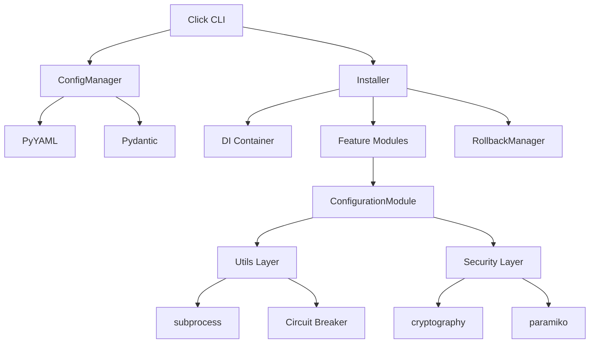

# Technology Stack Blueprint

**Debian VPS Configurator v2.0 — Comprehensive Technology Documentation**

> Thorough documentation of technologies and implementation patterns to facilitate consistent code generation.

---

## Table of Contents

1. [Technology Identification](#1-technology-identification)
2. [Core Technologies Analysis](#2-core-technologies-analysis)
3. [Implementation Patterns & Conventions](#3-implementation-patterns--conventions)
4. [Usage Examples](#4-usage-examples)
5. [Technology Stack Map](#5-technology-stack-map)
6. [Python Implementation Details](#6-python-implementation-details)
7. [Blueprint for New Code Implementation](#7-blueprint-for-new-code-implementation)
8. [Technology Relationship Diagrams](#8-technology-relationship-diagrams)
9. [Technology Decision Context](#9-technology-decision-context)

---

## 1. Technology Identification

### Project Detection Summary

| Aspect             | Detection                                  |
| ------------------ | ------------------------------------------ |
| **Project Type**   | Python CLI Application                     |
| **Package Name**   | `debian-vps-configurator`                  |
| **Version**        | 2.0.0                                      |
| **License**        | MIT                                        |
| **Python Version** | ≥3.11                                      |
| **Build System**   | setuptools ≥61.0                           |
| **Entry Point**    | `vps-configurator = configurator.cli:main` |

### Configuration Files Detected

| File                      | Purpose                                            | Format |
| ------------------------- | -------------------------------------------------- | ------ |
| `pyproject.toml`          | Project configuration, dependencies, tool settings | TOML   |
| `requirements.txt`        | Production dependencies                            | pip    |
| `requirements-dev.txt`    | Development dependencies                           | pip    |
| `pytest.ini`              | Test configuration                                 | INI    |
| `mkdocs.yml`              | Documentation build                                | YAML   |
| `.pre-commit-config.yaml` | Git hooks                                          | YAML   |
| `config/default.yaml`     | Application defaults                               | YAML   |

---

## 2. Core Technologies Analysis

### Python Stack v3.11+

#### Runtime & Language

| Technology      | Version | Purpose                     |
| --------------- | ------- | --------------------------- |
| **Python**      | ≥3.11   | Primary language            |
| **typing**      | stdlib  | Type annotations            |
| **dataclasses** | stdlib  | Data containers             |
| **abc**         | stdlib  | Abstract base classes       |
| **asyncio**     | stdlib  | Async support (limited use) |
| **threading**   | stdlib  | Concurrent execution        |
| **pathlib**     | stdlib  | Path operations             |
| **logging**     | stdlib  | Structured logging          |

#### Core Dependencies

| Package          | Version | Purpose                                  | License        |
| ---------------- | ------- | ---------------------------------------- | -------------- |
| **PyYAML**       | ≥6.0.2  | YAML configuration parsing               | MIT            |
| **Click**        | ≥8.1.7  | CLI framework                            | BSD-3-Clause   |
| **Rich**         | ≥13.9.4 | Beautiful terminal output, progress bars | MIT            |
| **Requests**     | ≥2.32.3 | HTTP client for downloads                | Apache-2.0     |
| **Paramiko**     | ≥3.5.0  | SSH operations                           | LGPL           |
| **Jinja2**       | ≥3.1.4  | Template rendering                       | BSD-3-Clause   |
| **Pydantic**     | ≥2.12.0 | Configuration validation                 | MIT            |
| **Cryptography** | ≥46.0.0 | Security operations                      | Apache-2.0/BSD |
| **Textual**      | ≥7.0.0  | Terminal UI framework                    | MIT            |
| **NetworkX**     | ≥3.4.2  | Dependency graph resolution              | BSD-3-Clause   |
| **psutil**       | ≥5.9.0  | System resource monitoring               | BSD-3-Clause   |

#### Security & Authentication

| Package    | Version | Purpose                    |
| ---------- | ------- | -------------------------- |
| **bcrypt** | ≥5.0.0  | Password hashing           |
| **PyNaCl** | ≥1.6.0  | Modern cryptography        |
| **pyotp**  | ≥2.9.0  | TOTP/HOTP for MFA          |
| **qrcode** | ≥8.0    | QR code generation for MFA |

#### Utility Libraries

| Package        | Version | Purpose                    |
| -------------- | ------- | -------------------------- |
| **invoke**     | ≥2.2.0  | Task execution             |
| **matplotlib** | ≥3.9.3  | Visualization (benchmarks) |

### Development Dependencies

#### Testing Framework

| Package            | Version | Purpose            |
| ------------------ | ------- | ------------------ |
| **pytest**         | ≥8.3.4  | Test framework     |
| **pytest-cov**     | ≥6.0.0  | Coverage reporting |
| **pytest-mock**    | ≥3.14.0 | Mocking support    |
| **pytest-asyncio** | ≥0.23.0 | Async test support |
| **coverage**       | ≥7.0.0  | Coverage metrics   |

#### Code Quality

| Package    | Version  | Purpose                                       |
| ---------- | -------- | --------------------------------------------- |
| **Ruff**   | ≥0.14.11 | Linting & formatting (replaces flake8, isort) |
| **MyPy**   | ≥1.13.0  | Static type checking                          |
| **Black**  | ≥24.10.0 | Code formatting                               |
| **Pylint** | ≥3.3.2   | Additional linting                            |
| **isort**  | ≥5.13.2  | Import sorting                                |
| **Bandit** | ≥1.9.2   | Security linting                              |

#### Type Stubs

| Package            | Version | Purpose             |
| ------------------ | ------- | ------------------- |
| **types-PyYAML**   | ≥6.0.12 | YAML type hints     |
| **types-requests** | ≥2.32.0 | Requests type hints |
| **types-paramiko** | ≥3.5.0  | Paramiko type hints |

### Documentation Stack

| Technology              | Purpose                    |
| ----------------------- | -------------------------- |
| **MkDocs**              | Documentation generator    |
| **Material for MkDocs** | Theme with dark/light mode |
| **pymdownx extensions** | Enhanced markdown          |

### Build & CI/CD

| Technology     | Purpose               |
| -------------- | --------------------- |
| **setuptools** | Package building      |
| **pre-commit** | Git hooks             |
| **virtualenv** | Environment isolation |

---

## 3. Implementation Patterns & Conventions

### Naming Conventions

#### Class/Type Naming

| Type            | Convention        | Example                                |
| --------------- | ----------------- | -------------------------------------- |
| Regular classes | `PascalCase`      | `ConfigManager`, `RollbackManager`     |
| Module classes  | `*Module` suffix  | `DockerModule`, `SecurityModule`       |
| Manager classes | `*Manager` suffix | `PackageCacheManager`                  |
| Error classes   | `*Error` suffix   | `ConfiguratorError`, `ValidationError` |
| Dataclasses     | `PascalCase`      | `RollbackAction`, `CommandResult`      |
| Enums           | `PascalCase`      | `CircuitState`                         |
| Type aliases    | `PascalCase`      | `ConfigDict`                           |

#### Method/Function Naming

| Type              | Convention               | Example               |
| ----------------- | ------------------------ | --------------------- |
| Public methods    | `snake_case`             | `install_packages()`  |
| Private methods   | `_snake_case`            | `_execute_action()`   |
| Protected methods | `_snake_case`            | `_load_config()`      |
| Factory methods   | `create_*`, `make_*`     | `create_breaker()`    |
| Validator methods | `validate_*`             | `validate_username()` |
| Boolean methods   | `is_*`, `has_*`, `can_*` | `is_service_active()` |

#### Variable Naming

| Type               | Convention         | Example                         |
| ------------------ | ------------------ | ------------------------------- |
| Local variables    | `snake_case`       | `config_file`, `package_list`   |
| Constants          | `UPPER_SNAKE_CASE` | `CONFIG_DIR`, `DEFAULT_TIMEOUT` |
| Class attributes   | `snake_case`       | `self.config`, `self.logger`    |
| Private attributes | `_snake_case`      | `self._instances`               |

#### File Naming

| Type           | Convention        | Example              |
| -------------- | ----------------- | -------------------- |
| Python modules | `snake_case.py`   | `circuit_breaker.py` |
| Test files     | `test_*.py`       | `test_rollback.py`   |
| Configuration  | `snake_case.yaml` | `default.yaml`       |

### Code Organization

#### Import Order (enforced by Ruff)

```python
# 1. Standard library
import logging
import os
from pathlib import Path
from typing import Any, Dict, List, Optional

# 2. Third-party packages
import yaml
from click import command, option
from rich.console import Console

# 3. Local imports
from configurator.core.rollback import RollbackManager
from configurator.exceptions import ConfiguratorError
```

#### Module Structure Pattern

```python
"""
Module docstring explaining purpose.

Handles:
- Responsibility 1
- Responsibility 2
"""

# Imports (ordered as above)
import ...

# Constants
CONSTANT_VALUE = "value"

# Type definitions
ConfigDict = Dict[str, Any]

# Classes
class MainClass:
    """Class docstring."""
    pass

# Module-level functions
def utility_function():
    """Function docstring."""
    pass
```

### Common Patterns

#### Error Handling

```python
# Pattern: User-friendly exceptions with WHAT/WHY/HOW
class ConfiguratorError(Exception):
    def __init__(self, what: str, why: str = "", how: str = ""):
        self.what = what
        self.why = why
        self.how = how

# Usage
raise ConfiguratorError(
    what="Configuration file not found",
    why="The specified path does not exist",
    how="Check the path and try again: /path/to/config.yaml"
)
```

#### Logging Pattern

```python
# Pattern: Class-level logger with module name
class MyClass:
    def __init__(self, logger: Optional[logging.Logger] = None):
        self.logger = logger or logging.getLogger(self.__class__.__name__)

    def method(self):
        self.logger.info("Operation starting...")
        self.logger.debug("Detailed info: %s", details)
        self.logger.error("Failed: %s", error)
```

#### Configuration Access

```python
# Pattern: Dot notation with defaults
class ConfigManager:
    def get(self, key: str, default: Any = None) -> Any:
        """Get value using dot notation: 'system.hostname'"""
        keys = key.split(".")
        value = self._config
        for k in keys:
            if isinstance(value, dict) and k in value:
                value = value[k]
            else:
                return default
        return value
```

#### Dependency Injection

```python
# Pattern: Optional injection with defaults
def __init__(
    self,
    config: Dict[str, Any],
    logger: Optional[logging.Logger] = None,
    rollback_manager: Optional[RollbackManager] = None,
):
    self.config = config
    self.logger = logger or logging.getLogger(self.__class__.__name__)
    self.rollback_manager = rollback_manager or RollbackManager()
```

#### Validation Pattern

```python
# Pattern: Strict mode with logging
def validate_input(self, value: str) -> bool:
    if not self._is_valid(value):
        if self.log_failures:
            self.logger.error(f"Validation failed: {value}")
        if self.strict_mode:
            raise ValidationError(f"Invalid: {value}")
        return False
    return True
```

---

## 4. Usage Examples

### CLI Command Implementation

```python
# Standard Click command pattern
@cli.command("check-system")
@click.option("--verbose", "-v", is_flag=True, help="Show detailed output")
@click.option("--json", "output_json", is_flag=True, help="Output as JSON")
def check_system(verbose: bool, output_json: bool) -> None:
    """Check system prerequisites and compatibility."""
    console = Console()

    try:
        validator = SystemValidator(config={})
        result = validator.validate()

        if output_json:
            console.print_json(data=result.to_dict())
        else:
            if result.passed:
                console.print("[green]✓ System check passed[/green]")
            else:
                console.print("[red]✗ System check failed[/red]")

    except ConfiguratorError as e:
        console.print(f"[red]{e}[/red]")
        raise SystemExit(1)
```

### Module Implementation

```python
class DockerModule(ConfigurationModule):
    """Docker installation module."""

    name = "Docker"
    description = "Docker Engine and Docker Compose"
    depends_on = ["system", "security"]
    priority = 50

    def validate(self) -> bool:
        """Validate Docker prerequisites."""
        if self.command_exists("docker"):
            result = self.run("docker --version", check=False)
            self.logger.info(f"Found existing Docker: {result.stdout.strip()}")
        return True

    def configure(self) -> bool:
        """Install and configure Docker."""
        self.logger.info("Installing Docker...")

        # Step-by-step with private methods
        self._add_docker_repository()
        self._install_docker()
        self._configure_daemon()
        self._start_services()

        self.logger.info("✓ Docker installed and configured")
        return True

    def verify(self) -> bool:
        """Verify Docker installation."""
        return self.is_service_active("docker")
```

### Service Layer Pattern

```python
class RollbackManager:
    """Manages rollback of installation changes."""

    def __init__(self, logger: Optional[logging.Logger] = None):
        self.logger = logger or logging.getLogger(__name__)
        self.actions: List[RollbackAction] = []
        self.state_file = ROLLBACK_STATE_FILE

    def add_package_remove(self, packages: List[str], description: str = "") -> None:
        """Add packages to be removed during rollback."""
        action = RollbackAction(
            action_type="package_remove",
            description=description or f"Remove packages: {', '.join(packages)}",
            data={"packages": packages},
        )
        self.actions.append(action)
        self._save_state()  # Persist for crash recovery

    def rollback(self, dry_run: bool = False) -> bool:
        """Execute rollback actions in reverse order."""
        for action in reversed(self.actions):
            self.logger.info(f"  • {action.description}")
            if not dry_run:
                self._execute_action(action)
        return True
```

### Test Pattern

```python
@pytest.mark.integration
class TestRollbackManager:
    """Tests for RollbackManager."""

    def test_add_and_execute_command_rollback(self, tmp_path):
        """Test adding and executing command rollback."""
        # Arrange
        state_file = tmp_path / "rollback-state.json"
        rollback = RollbackManager()
        rollback.state_file = state_file

        # Act
        rollback.add_command("echo 'test'", description="Test rollback")

        # Assert
        assert len(rollback.actions) == 1
        assert state_file.exists()

    def test_dry_run_rollback(self, tmp_path):
        """Test dry-run rollback doesn't execute."""
        output_file = tmp_path / "output.txt"
        rollback = RollbackManager()
        rollback.add_command(f"echo 'test' > {output_file}")

        rollback.rollback(dry_run=True)

        assert not output_file.exists()
```

---

## 5. Technology Stack Map

### Framework Usage

| Framework    | Usage                            | Configuration           |
| ------------ | -------------------------------- | ----------------------- |
| **Click**    | CLI commands, groups, options    | Decorators on functions |
| **Rich**     | Console output, tables, progress | `Console()` instances   |
| **Pydantic** | Config validation                | `config_schema.py`      |
| **Textual**  | TUI wizard                       | `wizard.py`             |
| **NetworkX** | Dependency graphs                | `dependencies.py`       |

### Integration Points

```
┌─────────────────────────────────────────────────────────────┐
│                        CLI (Click)                          │
│                            │                                │
│         ┌──────────────────┼──────────────────┐            │
│         ▼                  ▼                  ▼            │
│   ConfigManager      Installer          Validator          │
│   (PyYAML+Pydantic)  (Orchestration)    (System)           │
│         │                  │                  │            │
│         └──────────────────┼──────────────────┘            │
│                            ▼                                │
│              Modules (ConfigurationModule)                  │
│                            │                                │
│         ┌──────────────────┼──────────────────┐            │
│         ▼                  ▼                  ▼            │
│   run_command         Security            Rollback         │
│   (subprocess)        (cryptography)      (JSON state)     │
└─────────────────────────────────────────────────────────────┘
```

### Development Tooling

| Tool           | Configuration             | Purpose              |
| -------------- | ------------------------- | -------------------- |
| **Ruff**       | `pyproject.toml`          | Linting + formatting |
| **MyPy**       | `pyproject.toml`          | Type checking        |
| **pytest**     | `pytest.ini`              | Testing              |
| **pre-commit** | `.pre-commit-config.yaml` | Git hooks            |
| **Bandit**     | `pyproject.toml`          | Security linting     |

### Testing Infrastructure

| Category    | Location             | Purpose                  |
| ----------- | -------------------- | ------------------------ |
| Unit tests  | `tests/unit/`        | Isolated component tests |
| Integration | `tests/integration/` | Cross-component tests    |
| Security    | `tests/security/`    | Security validation      |
| Performance | `tests/performance/` | Benchmarks               |
| Validation  | `tests/validation/`  | Validator tests          |

---

## 6. Python Implementation Details

### Dependency Injection Pattern

```python
# Registration (in container.py)
container = Container()
container.singleton('config', lambda: ConfigManager())
container.factory('logger', lambda c: logging.getLogger())

# Resolution
config = container.get('config')

# Mocking for tests
container.mock('config', mock_config)
```

### Abstract Base Class Pattern

```python
class ConfigurationModule(ABC):
    """Abstract base class for all configuration modules."""

    # Class-level metadata
    name: str = "Base Module"
    description: str = "Base configuration module"
    priority: int = 100
    depends_on: List[str] = []

    @abstractmethod
    def validate(self) -> bool:
        """Must be implemented by subclasses."""

    @abstractmethod
    def configure(self) -> bool:
        """Must be implemented by subclasses."""

    @abstractmethod
    def verify(self) -> bool:
        """Must be implemented by subclasses."""

    def rollback(self) -> bool:
        """Default implementation, can be overridden."""
        return self.rollback_manager.rollback()
```

### Decorator Pattern

```python
def retry(
    max_retries: int = 3,
    base_delay: float = 1.0,
    backoff_factor: float = 2.0,
    exceptions: Tuple[Type[Exception], ...] = (Exception,),
) -> Callable:
    """Decorator for retrying with exponential backoff."""

    def decorator(func: Callable) -> Callable:
        @functools.wraps(func)
        def wrapper(*args, **kwargs):
            # ... retry logic
            pass
        return wrapper
    return decorator

# Usage
@retry(max_retries=5, base_delay=2.0)
def install_packages(packages: List[str]) -> bool:
    # ... implementation
```

### State Machine Pattern (Circuit Breaker)

```python
class CircuitState(Enum):
    CLOSED = "closed"      # Normal operation
    OPEN = "open"          # Failing, reject requests
    HALF_OPEN = "half_open"  # Testing recovery

class CircuitBreaker:
    def __init__(self, name: str, failure_threshold: int = 3):
        self.state = CircuitState.CLOSED
        self._state_lock = threading.RLock()

    def call(self, func: Callable, *args, **kwargs):
        with self._state_lock:
            if self.state == CircuitState.OPEN:
                if self._should_attempt_reset():
                    self._transition_to_half_open()
                else:
                    raise CircuitBreakerError(...)
        # Execute function
```

### Language Features Used

| Feature                | Python Version | Usage Location                    |
| ---------------------- | -------------- | --------------------------------- |
| Type hints             | 3.5+           | Throughout codebase               |
| Dataclasses            | 3.7+           | `RollbackAction`, `CommandResult` |
| `@dataclass` decorator | 3.7+           | Data containers                   |
| Walrus operator `:=`   | 3.8+           | Conditional assignments           |
| `match` statements     | 3.10+          | Pattern matching (limited)        |
| Union `X \| Y` syntax  | 3.10+          | Type unions                       |
| `Self` type            | 3.11+          | Return type annotations           |
| `tomllib`              | 3.11+          | TOML parsing (stdlib)             |

---

## 7. Blueprint for New Code Implementation

### File/Class Templates

#### New Module Template

```python
"""
<Feature> module for <purpose>.

Handles:
- <Responsibility 1>
- <Responsibility 2>
"""

from typing import Any, Dict, List, Optional
import logging

from configurator.modules.base import ConfigurationModule
from configurator.exceptions import ModuleExecutionError


class <Feature>Module(ConfigurationModule):
    """<Feature> installation and configuration module."""

    name = "<Feature>"
    description = "<Description>"
    depends_on = ["system"]  # Add dependencies
    priority = 50  # Execution priority (lower = earlier)
    mandatory = False  # Set True if failure should stop installation

    def validate(self) -> bool:
        """Validate prerequisites for <feature>."""
        # Check existing installation
        if self.command_exists("<command>"):
            self.logger.info("Found existing installation")

        # Check required dependencies
        # ...

        return True

    def configure(self) -> bool:
        """Install and configure <feature>."""
        self.logger.info("Installing <feature>...")

        # Add implementation steps
        self._install_packages()
        self._configure_settings()
        self._start_services()

        self.logger.info("✓ <Feature> installed successfully")
        return True

    def verify(self) -> bool:
        """Verify <feature> installation."""
        # Check service status
        if not self.is_service_active("<service>"):
            self.logger.error("<Service> is not running")
            return False

        # Check command availability
        if not self.command_exists("<command>"):
            self.logger.error("<Command> not found")
            return False

        return True

    def _install_packages(self) -> None:
        """Install required packages."""
        packages = ["package1", "package2"]
        self.install_packages_resilient(packages)

    def _configure_settings(self) -> None:
        """Configure settings."""
        # Implementation
        pass

    def _start_services(self) -> None:
        """Start and enable services."""
        self.enable_service("<service>")
```

#### New Validator Template

```python
"""<Validator> validator for <purpose>."""

from configurator.validators.base import BaseValidator, ValidationResult


class <Validator>Validator(BaseValidator):
    """Validates <what>."""

    name = "<validator_name>"
    description = "<Description>"
    tier = 1  # 1=Critical, 2=High, 3=Medium

    def validate(self) -> ValidationResult:
        """Run validation check."""
        try:
            # Perform validation
            if self._check_condition():
                return ValidationResult(
                    passed=True,
                    message="Validation passed",
                    details={"key": "value"}
                )
            else:
                return ValidationResult(
                    passed=False,
                    message="Validation failed",
                    details={"error": "reason"}
                )
        except Exception as e:
            return ValidationResult(
                passed=False,
                message=f"Validation error: {e}",
                details={"exception": str(e)}
            )

    def _check_condition(self) -> bool:
        """Internal validation logic."""
        return True
```

### Implementation Checklist

#### Adding a New Feature Module

- [ ] Create `configurator/modules/<feature>.py`
- [ ] Inherit from `ConfigurationModule`
- [ ] Implement `validate()`, `configure()`, `verify()`
- [ ] Add metadata: `name`, `description`, `depends_on`, `priority`
- [ ] Register in `configurator/modules/__init__.py`
- [ ] Add configuration section to `config/default.yaml`
- [ ] Create unit tests: `tests/unit/test_<feature>.py`
- [ ] Create integration tests: `tests/integration/test_<feature>_integration.py`
- [ ] Update documentation: `docs/modules/<feature>.md`
- [ ] Register dependencies in `configurator/dependencies/registry.py`

#### Adding a New CLI Command

- [ ] Add function to `configurator/cli.py`
- [ ] Add `@cli.command()` or `@<group>.command()` decorator
- [ ] Add Click options/arguments with help text
- [ ] Implement error handling with `ConfiguratorError`
- [ ] Add Rich console output
- [ ] Create tests for command
- [ ] Update CLI documentation

### Integration Points

| Component Type  | Integration Method                |
| --------------- | --------------------------------- |
| New module      | Register in `modules/__init__.py` |
| New service     | Register in `Container`           |
| New validator   | Add to tier directory             |
| New CLI command | Add to `cli.py` with decorators   |
| New exception   | Add to `exceptions.py`            |

### Testing Requirements

| Component    | Test Location                          | Test Type          |
| ------------ | -------------------------------------- | ------------------ |
| Modules      | `tests/unit/test_<module>.py`          | Unit + integration |
| Validators   | `tests/validation/test_<validator>.py` | Validation         |
| CLI commands | `tests/unit/test_cli.py`               | Unit               |
| Security     | `tests/security/`                      | Security           |
| Utilities    | `tests/unit/test_<util>.py`            | Unit               |

---

## 8. Technology Relationship Diagrams

### Stack Diagram

```
┌─────────────────────────────────────────────────────────────┐
│                    PRESENTATION LAYER                        │
│  ┌─────────────┐  ┌─────────────┐  ┌─────────────────────┐  │
│  │    Click    │  │   Textual   │  │        Rich         │  │
│  │  CLI 8.1+   │  │  TUI 7.0+   │  │   Console 13.0+     │  │
│  └─────────────┘  └─────────────┘  └─────────────────────┘  │
├─────────────────────────────────────────────────────────────┤
│                   ORCHESTRATION LAYER                        │
│  ┌─────────────┐  ┌─────────────┐  ┌─────────────────────┐  │
│  │  Installer  │  │  Container  │  │   RollbackManager   │  │
│  │(Orchestrate)│  │    (DI)     │  │   (Transactions)    │  │
│  └─────────────┘  └─────────────┘  └─────────────────────┘  │
├─────────────────────────────────────────────────────────────┤
│                      FEATURE LAYER                           │
│  ┌──────────┐ ┌──────────┐ ┌──────────┐ ┌──────────────────┐│
│  │ System   │ │ Security │ │ Desktop  │ │ 21 more modules  ││
│  │ Module   │ │ Module   │ │ Module   │ │                  ││
│  └──────────┘ └──────────┘ └──────────┘ └──────────────────┘│
├─────────────────────────────────────────────────────────────┤
│                    FOUNDATION LAYER                          │
│  ┌─────────────┐  ┌─────────────┐  ┌─────────────────────┐  │
│  │   PyYAML    │  │ Cryptography│  │      Pydantic       │  │
│  │  Config     │  │  Security   │  │    Validation       │  │
│  └─────────────┘  └─────────────┘  └─────────────────────┘  │
│  ┌─────────────┐  ┌─────────────┐  ┌─────────────────────┐  │
│  │  NetworkX   │  │   psutil    │  │     subprocess      │  │
│  │ Dep Graph   │  │  Monitoring │  │   Command Exec      │  │
│  └─────────────┘  └─────────────┘  └─────────────────────┘  │
└─────────────────────────────────────────────────────────────┘
```

### Dependency Flow



### Data Flow

```
User Input → CLI → ConfigManager → Installer
                         ↓
                    Validator ─────────────→ Exit if failed
                         ↓
                    Module.validate()
                         ↓
                    Module.configure() ←──── RollbackManager
                         ↓                        ↑
                    Module.verify() ─────────→ Rollback if failed
                         ↓
                    Success Report
```

---

## 9. Technology Decision Context

### Technology Choices Rationale

| Technology       | Reason                             | Alternative Considered              |
| ---------------- | ---------------------------------- | ----------------------------------- |
| **Python 3.11+** | Modern features, type hints, async | Python 3.9 (lacks features)         |
| **Click**        | Mature, composable CLI framework   | argparse (verbose), Typer (too new) |
| **Rich**         | Beautiful output, progress bars    | Colorama (limited), termcolor       |
| **Pydantic v2**  | Fast validation, good errors       | Marshmallow (slower), attrs         |
| **Ruff**         | Fast, replaces multiple tools      | flake8 + isort + black              |
| **pytest**       | Fixtures, plugins, ecosystem       | unittest (verbose)                  |
| **Textual**      | Modern TUI, reactive               | curses (low-level), urwid           |

### Deprecated/Legacy Technologies

| Technology      | Status   | Replacement |
| --------------- | -------- | ----------- |
| Black formatter | Replaced | Ruff format |
| isort           | Replaced | Ruff isort  |
| flake8          | Replaced | Ruff lint   |

### Technology Constraints

| Constraint    | Reason                                   |
| ------------- | ---------------------------------------- |
| Python ≥3.11  | Uses 3.11 features (tomllib, typing)     |
| Linux only    | System administration tool               |
| Debian 12/13  | Target platform                          |
| Root required | Package installation, service management |

### Upgrade Paths

| Technology | Current | Target       | Timeline |
| ---------- | ------- | ------------ | -------- |
| Python     | 3.11    | 3.12+        | Q2 2026  |
| Pydantic   | 2.x     | 2.x (latest) | Ongoing  |
| Click      | 8.x     | 8.x (latest) | Ongoing  |
| pytest     | 8.x     | 8.x (latest) | Ongoing  |

---

## Appendix: Quick Reference

### Package Categories

| Category     | Packages                            |
| ------------ | ----------------------------------- |
| **CLI**      | click, rich, textual                |
| **Config**   | pyyaml, pydantic                    |
| **Security** | cryptography, bcrypt, pynacl, pyotp |
| **Network**  | requests, paramiko                  |
| **System**   | psutil, subprocess (stdlib)         |
| **Testing**  | pytest, pytest-cov, pytest-mock     |
| **Quality**  | ruff, mypy, bandit                  |

### Version Summary

```
Python: ≥3.11
PyYAML: ≥6.0.2
Click: ≥8.1.7
Rich: ≥13.9.4
Pydantic: ≥2.12.0
pytest: ≥8.3.4
Ruff: ≥0.14.11
```

---

_Last updated: 2026-01-17_
_Format: Markdown_
_Categorization: Layer_
