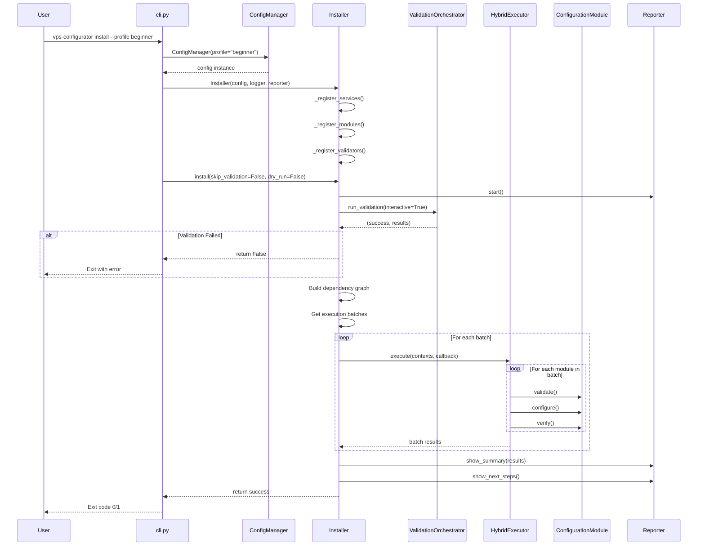
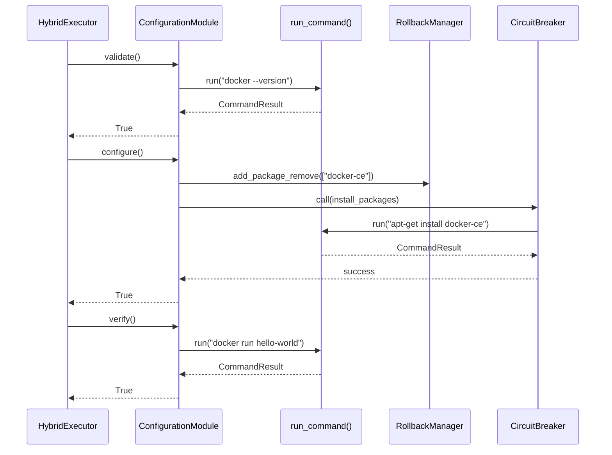

# Project Workflow Analysis Blueprint

**Debian VPS Configurator v2.0 — End-to-End Workflow Documentation**

> Representative workflows that serve as implementation templates for similar features.

---

## Table of Contents

1. [Initial Detection](#1-initial-detection)
2. [Workflow 1: Installation Flow](#2-workflow-1-installation-flow)
3. [Workflow 2: Module Execution Flow](#3-workflow-2-module-execution-flow)
4. [Workflow 3: Validation Flow](#4-workflow-3-validation-flow)
5. [Workflow 4: Rollback Flow](#5-workflow-4-rollback-flow)
6. [Workflow 5: Secrets Management Flow](#6-workflow-5-secrets-management-flow)
7. [Naming Conventions](#7-naming-conventions)
8. [Implementation Templates](#8-implementation-templates)
9. [Implementation Guidelines](#9-implementation-guidelines)

---

## 1. Initial Detection

### Project Architecture

| Aspect           | Detection                             |
| ---------------- | ------------------------------------- |
| **Project Type** | Python CLI Application                |
| **Entry Points** | CLI (Click commands)                  |
| **Persistence**  | YAML Configuration, JSON State Files  |
| **Architecture** | Layered + Plugin-Based + Event-Driven |

### Architecture Pattern

The project follows a **Modular Plugin-Based Layered Architecture** with:

1. **Presentation Layer** — CLI commands (Click), TUI (Textual)
2. **Orchestration Layer** — Installer, HybridExecutor, HooksManager
3. **Feature Layer** — 21+ ConfigurationModule implementations
4. **Foundation Layer** — Utils, Security, Validators

### Entry Points Detected

| Type         | Location                   | Technology      |
| ------------ | -------------------------- | --------------- |
| CLI Commands | `configurator/cli.py`      | Click framework |
| TUI Wizard   | `configurator/wizard.py`   | Textual         |
| Module entry | `configurator/__main__.py` | `python -m`     |

### Persistence Mechanisms

| Type           | Location              | Format |
| -------------- | --------------------- | ------ |
| Configuration  | `config/default.yaml` | YAML   |
| Rollback State | `rollback-state.json` | JSON   |
| FIM Baseline   | FIM state files       | JSON   |
| Secrets        | Encrypted storage     | Fernet |

---

## 2. Workflow 1: Installation Flow

### Overview

| Attribute    | Value                                                 |
| ------------ | ----------------------------------------------------- |
| **Name**     | Full Installation Workflow                            |
| **Purpose**  | Transform a Debian VPS into a development workstation |
| **Trigger**  | `vps-configurator install` command                    |
| **Duration** | 10-30 minutes depending on modules                    |

### Files Involved

```
configurator/cli.py                    # Entry point (install command)
configurator/config.py                 # Configuration loading
configurator/core/installer.py          # Orchestration
configurator/core/container.py          # Dependency injection
configurator/core/dependency.py         # Dependency graph
configurator/core/execution/hybrid.py   # Parallel/sequential execution
configurator/core/rollback.py           # Rollback management
configurator/validators/orchestrator.py # Pre-flight validation
configurator/modules/*.py               # Feature modules
configurator/core/reporter/console.py   # Progress reporting
```

### Sequence Diagram



### Entry Point Implementation

**File:** [cli.py](file:///home/racoon/Desktop/debian-vps-workstation/configurator/cli.py)

```python
@main.command()
@click.option(
    "--profile", "-p",
    type=click.Choice(["beginner", "intermediate", "advanced"]),
    default=None,
    help="Installation profile to use",
)
@click.option(
    "--config", "-c",
    type=click.Path(exists=True, path_type=Path),
    default=None,
    help="Path to custom configuration file",
)
@click.option("--non-interactive", "-y", is_flag=True)
@click.option("--skip-validation", is_flag=True)
@click.option("--dry-run", is_flag=True)
@click.option("--no-parallel", is_flag=True)
@click.option("--parallel-workers", type=int, default=3)
@click.option("--verbose", "-v", is_flag=True)
@click.pass_context
def install(
    ctx: click.Context,
    profile: Optional[str],
    config: Optional[Path],
    non_interactive: bool,
    skip_validation: bool,
    dry_run: bool,
    no_parallel: bool,
    parallel_workers: int,
    verbose: bool,
):
    """Install and configure the workstation."""
    logger = ctx.obj["logger"]

    # Load configuration
    config_manager = ConfigManager(
        config_file=config,
        profile=profile,
    )
    config_manager.validate()

    # Create installer and run
    reporter = ProgressReporter(console)
    installer = Installer(
        config=config_manager,
        logger=logger,
        reporter=reporter,
    )

    success = installer.install(
        skip_validation=skip_validation,
        dry_run=dry_run,
        parallel=not no_parallel,
    )

    sys.exit(0 if success else 1)
```

### Service Layer Implementation

**File:** [installer.py](file:///home/racoon/Desktop/debian-vps-workstation/configurator/core/installer.py)

```python
class Installer:
    """Orchestrates the installation of all enabled modules."""

    def __init__(
        self,
        config: ConfigManager,
        logger: Optional[logging.Logger] = None,
        reporter: Optional[ReporterInterface] = None,
        container: Optional[Container] = None,
    ):
        self.config = config
        self.logger = logger or logging.getLogger(__name__)
        self.reporter = reporter or DEFAULT_REPORTER()
        self.container = container or Container()

        # Initialize core services
        self.rollback_manager = RollbackManager(self.logger)
        self.validator = SystemValidator(self.logger)
        self.hooks_manager = HooksManager()
        self.hybrid_executor = HybridExecutor(
            max_workers=self.config.get("performance.max_workers", 4),
            logger=self.logger
        )

        # Register services and modules
        self._register_services()
        self._register_modules()
        self._register_validators()

    def install(
        self,
        skip_validation: bool = False,
        dry_run: bool = False,
        parallel: bool = True
    ) -> bool:
        """Run the full installation."""
        try:
            # 1. Validation
            if not skip_validation:
                self.reporter.start_phase("System Validation")
                success, _ = self.validator_orchestrator.run_validation()
                if not success:
                    return False

            # 2. Load Plugins & Execute Hooks
            self.plugin_manager.load_plugins()
            self.hooks_manager.execute(HookEvent.BEFORE_INSTALLATION)

            # 3. Build Dependency Graph
            enabled_modules = self.config.get_enabled_modules()
            graph = DependencyGraph(self.logger)
            # ... populate graph

            # 4. Execute Batches
            batches = graph.get_execution_batches()
            for batch in batches:
                results = self.hybrid_executor.execute(contexts, callback)
                # ... handle results

            # 5. Summary
            self.reporter.show_summary(results)
            return all(r.success for r in results.values())

        except Exception as e:
            self.logger.exception("Installation failed")
            return False
```

### Error Handling Pattern

```python
# CLI Level
try:
    config_manager = ConfigManager(
        config_file=config,
        profile=profile,
    )
    config_manager.validate()
except Exception as e:
    logger.error(str(e))
    sys.exit(1)

# Installer Level
try:
    # ... installation logic
except Exception as e:
    self.logger.exception("Installation failed")
    self.reporter.error(str(e))
    self.hooks_manager.execute(HookEvent.ON_INSTALLATION_ERROR, error=str(e))
    return False

# Module Level
try:
    success = module.configure()
except ModuleExecutionError as e:
    self.rollback_manager.add_command(...)
    raise
```

---

## 3. Workflow 2: Module Execution Flow

### Overview

| Attribute   | Value                                           |
| ----------- | ----------------------------------------------- |
| **Name**    | Single Module Execution                         |
| **Purpose** | Install and configure a single feature          |
| **Trigger** | Called by Installer for each enabled module     |
| **Pattern** | Template Method (validate → configure → verify) |

### Files Involved

```
configurator/modules/base.py            # Abstract base class
configurator/modules/<specific>.py      # Concrete implementation
configurator/core/execution/hybrid.py   # Executor
configurator/core/rollback.py           # State tracking
configurator/utils/command.py           # Shell execution
```

### Sequence Diagram



### Module Implementation Pattern

**File:** [modules/docker.py](file:///home/racoon/Desktop/debian-vps-workstation/configurator/modules/docker.py)

```python
class DockerModule(ConfigurationModule):
    """Docker installation module."""

    name = "Docker"
    description = "Docker Engine and Docker Compose"
    depends_on = ["system", "security"]
    priority = 50
    force_sequential = False
    mandatory = False

    def validate(self) -> bool:
        """Validate Docker prerequisites."""
        # Check existing installation
        if self.command_exists("docker"):
            result = self.run("docker --version", check=False)
            self.logger.info(f"Found: {result.stdout.strip()}")
        return True

    def configure(self) -> bool:
        """Install and configure Docker."""
        self.logger.info("Installing Docker...")

        # Private methods for each step
        self._add_docker_repository()
        self._install_docker()
        self._configure_daemon()
        self._configure_permissions()
        self._start_services()

        self.logger.info("✓ Docker installed")
        return True

    def verify(self) -> bool:
        """Verify Docker installation."""
        if not self.is_service_active("docker"):
            self.logger.error("Docker service not running")
            return False

        result = self.run("docker run --rm hello-world", check=False)
        return result.return_code == 0

    def _install_docker(self) -> None:
        """Install Docker packages with resilience."""
        packages = ["docker-ce", "docker-ce-cli", "containerd.io"]

        # Register rollback before installation
        self.rollback_manager.add_package_remove(
            packages,
            description="Remove Docker packages"
        )

        # Install with circuit breaker and retry
        self.install_packages_resilient(packages)
```

### Base Class Utilities

**File:** [modules/base.py](file:///home/racoon/Desktop/debian-vps-workstation/configurator/modules/base.py)

```python
class ConfigurationModule(ABC):
    """Abstract base class for all configuration modules."""

    _APT_LOCK = threading.Lock()  # Thread-safe package installation

    def run(
        self,
        command: str,
        check: bool = True,
        capture_output: bool = True,
        **kwargs
    ) -> CommandResult:
        """Execute shell command with dry-run support."""
        if self.dry_run:
            self.logger.info(f"[DRY-RUN] Would execute: {command}")
            return CommandResult(command=command, return_code=0, stdout="", stderr="")

        return run_command(command, check=check, capture_output=capture_output, **kwargs)

    def install_packages_resilient(self, packages: List[str]) -> bool:
        """Install packages with retry and circuit breaker."""
        with self._APT_LOCK:
            return self.circuit_breaker_manager.call(
                "apt",
                self._install_with_retry,
                packages
            )

    def command_exists(self, command: str) -> bool:
        """Check if a command exists in PATH."""
        result = self.run(f"command -v {command}", check=False)
        return result.return_code == 0
```

---

## 4. Workflow 3: Validation Flow

### Overview

| Attribute   | Value                                                |
| ----------- | ---------------------------------------------------- |
| **Name**    | Pre-flight Validation                                |
| **Purpose** | Ensure system meets requirements before installation |
| **Trigger** | Called by Installer before module execution          |
| **Pattern** | Tiered Validation (Critical → High → Medium)         |

### Files Involved

```
configurator/validators/orchestrator.py         # Orchestration
configurator/validators/base.py                 # Base validator
configurator/validators/tier1_critical/*.py     # Critical validators
configurator/validators/tier2_high/*.py         # High priority
configurator/validators/tier3_medium/*.py       # Medium priority
```

### Validator Implementation

**File:** [validators/orchestrator.py](file:///home/racoon/Desktop/debian-vps-workstation/configurator/validators/orchestrator.py)

```python
class ValidationOrchestrator:
    """Coordinates validation execution across tiers."""

    def __init__(self, logger: Optional[logging.Logger] = None):
        self.logger = logger or logging.getLogger(__name__)
        self.validators: Dict[int, List[BaseValidator]] = {
            1: [],  # Critical
            2: [],  # High
            3: [],  # Medium
        }

    def register_validator(self, tier: int, validator: BaseValidator) -> None:
        """Register a validator in a specific tier."""
        self.validators[tier].append(validator)

    def run_validation(
        self,
        interactive: bool = True
    ) -> Tuple[bool, Dict[str, ValidationResult]]:
        """Run all validators in tier order."""
        all_results = {}

        for tier in sorted(self.validators.keys()):
            for validator in self.validators[tier]:
                result = validator.validate()
                all_results[validator.name] = result

                if not result.passed:
                    if tier == 1:  # Critical - must pass
                        return False, all_results
                    elif tier == 2 and interactive:
                        # Prompt user to continue
                        if not self._prompt_continue(validator.name, result):
                            return False, all_results

        return True, all_results
```

**File:** [validators/tier1_critical/root_access.py](file:///home/racoon/Desktop/debian-vps-workstation/configurator/validators/tier1_critical/root_access.py)

```python
class RootAccessValidator(BaseValidator):
    """Validates root/sudo access."""

    name = "root_access"
    description = "Checks for administrative privileges"

    def validate(self) -> ValidationResult:
        """Check if running as root or with sudo access."""
        import os

        if os.geteuid() == 0:
            return ValidationResult(
                passed=True,
                message="Running as root"
            )

        # Check sudo access
        result = run_command("sudo -n true", check=False)
        if result.return_code == 0:
            return ValidationResult(
                passed=True,
                message="Sudo access available"
            )

        return ValidationResult(
            passed=False,
            message="Root access required",
            details="Run with: sudo vps-configurator install"
        )
```

---

## 5. Workflow 4: Rollback Flow

### Overview

| Attribute   | Value                                               |
| ----------- | --------------------------------------------------- |
| **Name**    | Rollback Workflow                                   |
| **Purpose** | Undo installation changes                           |
| **Trigger** | `vps-configurator rollback` or installation failure |
| **Pattern** | Command Pattern (reverse execution)                 |

### Files Involved

```
configurator/cli.py                 # rollback command
configurator/core/rollback.py       # RollbackManager
configurator/core/installer.py      # rollback() method
```

### Rollback Implementation

**File:** [core/rollback.py](file:///home/racoon/Desktop/debian-vps-workstation/configurator/core/rollback.py)

```python
@dataclass
class RollbackAction:
    """A single action that can be rolled back."""
    action_type: str  # "command", "file_restore", "package_remove", "service_stop"
    description: str
    data: Dict[str, Any]
    timestamp: datetime = field(default_factory=datetime.now)


class RollbackManager:
    """Manages rollback of installation changes."""

    def add_command(self, command: str, description: str = "") -> None:
        """Add a command to be executed during rollback."""
        action = RollbackAction(
            action_type="command",
            description=description or f"Execute: {command}",
            data={"command": command},
        )
        self.actions.append(action)
        self._save_state()

    def add_package_remove(self, packages: List[str], description: str = "") -> None:
        """Add packages to be removed during rollback."""
        action = RollbackAction(
            action_type="package_remove",
            description=description or f"Remove: {', '.join(packages)}",
            data={"packages": packages},
        )
        self.actions.append(action)
        self._save_state()

    def rollback(self, dry_run: bool = False) -> bool:
        """Execute all rollback actions in reverse order."""
        self.logger.info(f"Starting rollback ({len(self.actions)} actions)")

        for action in reversed(self.actions):
            self.logger.info(f"  • {action.description}")
            if not dry_run:
                self._execute_action(action)

        self._clear_state()
        return True

    def _execute_action(self, action: RollbackAction) -> bool:
        """Execute a single rollback action."""
        if action.action_type == "command":
            run_command(action.data["command"], check=False)
        elif action.action_type == "package_remove":
            packages = " ".join(action.data["packages"])
            run_command(f"apt-get remove -y {packages}", check=False)
        elif action.action_type == "file_restore":
            shutil.copy(action.data["backup"], action.data["original"])
        elif action.action_type == "service_stop":
            run_command(f"systemctl stop {action.data['service']}", check=False)
        return True
```

---

## 6. Workflow 5: Secrets Management Flow

### Overview

| Attribute   | Value                                          |
| ----------- | ---------------------------------------------- |
| **Name**    | Secrets CRUD Operations                        |
| **Purpose** | Securely store and retrieve sensitive data     |
| **Trigger** | `vps-configurator secrets set/get/list/delete` |
| **Pattern** | Command Group (Click) + Manager Class          |

### Files Involved

```
configurator/cli.py              # secrets command group
configurator/core/secrets.py     # SecretsManager
```

### CLI Command Group Pattern

**File:** [cli.py](file:///home/racoon/Desktop/debian-vps-workstation/configurator/cli.py)

```python
@main.group()
def secrets():
    """Manage encrypted secrets."""


@secrets.command("set")
@click.argument("key")
@click.password_option()
def secret_set(key: str, password: str):
    """Store a secure secret."""
    try:
        manager = SecretsManager()
        manager.store(key, password)
        console.print(f"[green]✓ Secret '{key}' stored successfully[/green]")
    except Exception as e:
        console.print(f"[red]Error storing secret: {e}[/red]")
        sys.exit(1)


@secrets.command("get")
@click.argument("key")
def secret_get(key: str):
    """Retrieve a secure secret."""
    try:
        manager = SecretsManager()
        value = manager.retrieve(key)
        if value:
            console.print(value)
        else:
            console.print(f"[yellow]Secret '{key}' not found[/yellow]")
            sys.exit(1)
    except Exception as e:
        console.print(f"[red]Error: {e}[/red]")
        sys.exit(1)


@secrets.command("list")
def secret_list():
    """List all stored secret keys."""
    manager = SecretsManager()
    keys = manager.list_keys()
    if keys:
        console.print("\n[bold]Stored Secrets:[/bold]")
        for key in keys:
            console.print(f"  • {key}")
    else:
        console.print("[yellow]No secrets stored.[/yellow]")


@secrets.command("delete")
@click.argument("key")
@click.confirmation_option(prompt="Are you sure?")
def secret_delete(key: str):
    """Delete a stored secret."""
    manager = SecretsManager()
    if manager.delete(key):
        console.print(f"[green]✓ Secret '{key}' deleted[/green]")
    else:
        console.print(f"[yellow]Secret '{key}' not found[/yellow]")
        sys.exit(1)
```

---

## 7. Naming Conventions

### CLI Naming

| Type          | Convention       | Example                          |
| ------------- | ---------------- | -------------------------------- |
| Main group    | `main`           | `@click.group()`                 |
| Subcommand    | `kebab-case`     | `fim-check`, `secret-set`        |
| Command group | `noun`           | `secrets`, `audit`, `cache`      |
| Options       | `--kebab-case`   | `--dry-run`, `--non-interactive` |
| Short options | `-single-letter` | `-v`, `-p`, `-c`                 |

### Class Naming

| Type            | Convention          | Example                                   |
| --------------- | ------------------- | ----------------------------------------- |
| Module class    | `<Feature>Module`   | `DockerModule`, `SecurityModule`          |
| Manager class   | `<Resource>Manager` | `RollbackManager`, `SecretsManager`       |
| Validator class | `<Check>Validator`  | `RootAccessValidator`                     |
| Reporter class  | `<Type>Reporter`    | `ConsoleReporter`, `RichProgressReporter` |

### Method Naming

| Type           | Convention                     | Example                               |
| -------------- | ------------------------------ | ------------------------------------- |
| Public action  | `verb_noun()`                  | `install_packages()`, `run_command()` |
| Boolean check  | `is_*()`, `has_*()`, `can_*()` | `is_service_active()`                 |
| Private helper | `_verb_noun()`                 | `_execute_action()`                   |
| Factory        | `create_*()`, `make_*()`       | `make(name, config)`                  |

### File Organization

```
configurator/
├── cli.py                    # All CLI commands
├── config.py                 # Configuration management
├── exceptions.py             # All exceptions
├── core/
│   ├── installer.py          # Main orchestrator
│   ├── container.py          # DI container
│   ├── rollback.py           # Rollback manager
│   └── execution/            # Execution strategies
├── modules/
│   ├── base.py               # Abstract base
│   └── <feature>.py          # One per feature
├── validators/
│   ├── base.py               # Abstract base
│   ├── orchestrator.py       # Coordinator
│   └── tier<N>_<level>/      # By priority
└── utils/
    ├── command.py            # Shell execution
    └── <utility>.py          # One per utility
```

---

## 8. Implementation Templates

### New CLI Command Template

```python
@main.command()
@click.option("--dry-run", is_flag=True, help="Preview without changes")
@click.option("--verbose", "-v", is_flag=True, help="Enable verbose output")
@click.pass_context
def new_command(ctx: click.Context, dry_run: bool, verbose: bool):
    """
    <Command description>.

    Examples:

      # Basic usage
      vps-configurator new-command

      # With options
      vps-configurator new-command --dry-run -v
    """
    logger = ctx.obj["logger"]

    try:
        # Implementation
        if dry_run:
            console.print("[yellow]DRY RUN MODE[/yellow]")

        # Business logic here
        result = do_something()

        if result:
            console.print("[green]✓ Success[/green]")
        else:
            console.print("[red]✗ Failed[/red]")
            sys.exit(1)

    except Exception as e:
        logger.exception("Command failed")
        console.print(f"[red]Error: {e}[/red]")
        sys.exit(1)
```

### New Command Group Template

```python
@main.group()
def resource():
    """Manage <resource>."""


@resource.command("list")
def resource_list():
    """List all <resources>."""
    try:
        manager = ResourceManager()
        items = manager.list_all()

        if items:
            console.print("\n[bold]<Resources>:[/bold]")
            for item in items:
                console.print(f"  • {item}")
        else:
            console.print("[yellow]No <resources> found.[/yellow]")

    except Exception as e:
        console.print(f"[red]Error: {e}[/red]")
        sys.exit(1)


@resource.command("create")
@click.argument("name")
def resource_create(name: str):
    """Create a new <resource>."""
    try:
        manager = ResourceManager()
        manager.create(name)
        console.print(f"[green]✓ <Resource> '{name}' created[/green]")
    except Exception as e:
        console.print(f"[red]Error: {e}[/red]")
        sys.exit(1)


@resource.command("delete")
@click.argument("name")
@click.confirmation_option(prompt="Are you sure?")
def resource_delete(name: str):
    """Delete a <resource>."""
    try:
        manager = ResourceManager()
        if manager.delete(name):
            console.print(f"[green]✓ <Resource> '{name}' deleted[/green]")
        else:
            console.print(f"[yellow]<Resource> '{name}' not found[/yellow]")
            sys.exit(1)
    except Exception as e:
        console.print(f"[red]Error: {e}[/red]")
        sys.exit(1)
```

### New Manager Class Template

```python
class ResourceManager:
    """Manages <resource> operations."""

    def __init__(self, logger: Optional[logging.Logger] = None):
        self.logger = logger or logging.getLogger(__name__)
        self._items: Dict[str, Any] = {}
        self._load_state()

    def list_all(self) -> List[str]:
        """List all resources."""
        return list(self._items.keys())

    def get(self, name: str) -> Optional[Any]:
        """Get a resource by name."""
        return self._items.get(name)

    def create(self, name: str, **kwargs) -> bool:
        """Create a new resource."""
        if name in self._items:
            raise ValueError(f"Resource '{name}' already exists")

        self._items[name] = kwargs
        self._save_state()
        self.logger.info(f"Created resource: {name}")
        return True

    def delete(self, name: str) -> bool:
        """Delete a resource."""
        if name not in self._items:
            return False

        del self._items[name]
        self._save_state()
        self.logger.info(f"Deleted resource: {name}")
        return True

    def _load_state(self) -> None:
        """Load state from file."""
        pass  # Implementation

    def _save_state(self) -> None:
        """Save state to file."""
        pass  # Implementation
```

---

## 9. Implementation Guidelines

### Step-by-Step Implementation Process

1. **Define the Interface**
   - Create abstract base class if needed
   - Define method signatures with type hints
   - Document expected behavior in docstrings

2. **Implement Core Logic**
   - Start with the happy path
   - Use dependency injection for external services
   - Add rollback registration before state changes

3. **Add Error Handling**
   - Use custom exceptions from `exceptions.py`
   - Log errors with context
   - Return meaningful error messages to users

4. **Register with System**
   - Add to DI container if service
   - Register in `__init__.py` if module
   - Add CLI command if user-facing

5. **Write Tests**
   - Unit tests for core logic
   - Integration tests for workflows
   - Mock external dependencies

### Common Pitfalls to Avoid

| Pitfall                       | Solution                              |
| ----------------------------- | ------------------------------------- |
| Missing rollback registration | Always `add_*` before state change    |
| Bare `except:` clauses        | Catch specific exceptions             |
| Hardcoded paths               | Use `Path` and config values          |
| Blocking the main thread      | Use `ThreadPoolExecutor` for parallel |
| Ignoring dry-run mode         | Check `self.dry_run` before changes   |
| Missing progress updates      | Call `reporter.update()` regularly    |

### Extension Mechanisms

1. **Plugins** — Add to `configurator/plugins/`
2. **Hooks** — Register via `HooksManager`
3. **Validators** — Add to tier directories
4. **Modules** — Inherit from `ConfigurationModule`
5. **Reporters** — Implement `ReporterInterface`

---

## Conclusion

### Key Patterns to Follow

1. **Dependency Injection** — Accept optional dependencies with defaults
2. **Template Method** — `validate() → configure() → verify()` lifecycle
3. **Command Pattern** — Rollback actions as executable objects
4. **Observer Pattern** — Hooks for lifecycle events
5. **Circuit Breaker** — Resilience for external operations
6. **Tiered Validation** — Critical → High → Medium priority

### Critical Implementation Requirements

- [ ] All state changes must register rollback actions
- [ ] All CLI commands must handle exceptions gracefully
- [ ] All modules must implement the 3-phase lifecycle
- [ ] All validators must return `ValidationResult`
- [ ] All async operations must support dry-run mode

---

_Last updated: 2026-01-17_
_Documented workflows: 5_
_Architecture pattern: Layered + Plugin-Based + Event-Driven_
