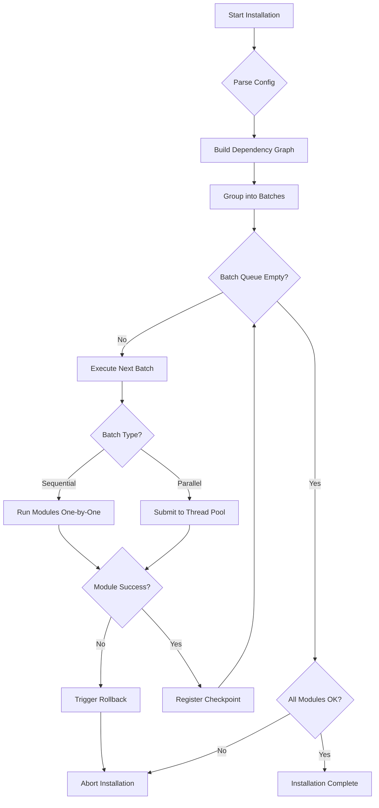

# Module Execution Order

This document describes the order in which modules are executed during installation and the dependency relationships between them.

## Complete Dependency Graph

```ascii
system (Priority 10) [MANDATORY]
  │
  ├─► security (20) [MANDATORY]
  │     │
  │     ├─► rbac (25)
  │     │
  │     └─► desktop (30)
  │           │
  │           └─► Editors (60-62)
  │                 ├─► vscode (60)
  │                 ├─► cursor (61)
  │                 └─► neovim (62)
  │
  ├─► Languages (40-45) [PARALLEL GROUP]
  │     ├─► python (40)
  │     ├─► nodejs (41)
  │     ├─► golang (42)
  │     ├─► rust (43)
  │     ├─► java (44)
  │     └─► php (45)
  │
  ├─► Development Tools (50-54) [PARALLEL GROUP]
  │     ├─► docker (50) [depends: system, security]
  │     ├─► git (51)
  │     ├─► databases (52)
  │     ├─► devops (53) [depends: docker]
  │     └─► utilities (54)
  │
  └─► Infrastructure (70-80) [PARALLEL GROUP]
        ├─► wireguard (70) [depends: system, security]
        ├─► caddy (71) [depends: system, security]
        └─► netdata (80)
```

---

## Module Priority Levels

Modules execute in order of **priority** (lower number = earlier execution):

| Priority | Module      | Dependencies         | Parallel? | Description                           |
| -------- | ----------- | -------------------- | --------- | ------------------------------------- |
| **10**   | `system`    | None                 | No        | Base system configuration (MANDATORY) |
| **20**   | `security`  | `system`             | No        | Firewall, SSH hardening (MANDATORY)   |
| **25**   | `rbac`      | `system`, `security` | No        | Role-based access control             |
| **30**   | `desktop`   | `system`, `security` | No        | XRDP + XFCE desktop environment       |
| **40**   | `python`    | `system`             | Yes       | Python runtime and tools              |
| **41**   | `nodejs`    | `system`             | Yes       | Node.js and npm                       |
| **42**   | `golang`    | `system`             | Yes       | Go compiler and tools                 |
| **43**   | `rust`      | `system`             | Yes       | Rust compiler and Cargo               |
| **44**   | `java`      | `system`             | Yes       | OpenJDK and Maven                     |
| **45**   | `php`       | `system`             | Yes       | PHP runtime and Composer              |
| **50**   | `docker`    | `system`, `security` | Yes       | Docker Engine and Compose             |
| **51**   | `git`       | `system`             | Yes       | Git version control                   |
| **52**   | `databases` | `system`             | Yes       | PostgreSQL, MySQL, Redis              |
| **53**   | `devops`    | `system`, `docker`   | Yes       | Kubernetes tools, Terraform           |
| **54**   | `utilities` | `system`             | Yes       | Common CLI utilities                  |
| **60**   | `vscode`    | `system`             | Yes       | Visual Studio Code                    |
| **61**   | `cursor`    | `system`             | Yes       | Cursor AI editor                      |
| **62**   | `neovim`    | `system`             | Yes       | Neovim text editor                    |
| **70**   | `wireguard` | `system`, `security` | Yes       | WireGuard VPN                         |
| **71**   | `caddy`     | `system`, `security` | Yes       | Caddy web server                      |
| **80**   | `netdata`   | `system`             | No        | Netdata monitoring                    |

---

## Batch Execution Model

The installer groups modules into **batches** based on dependencies and executes batches sequentially, but modules within a batch run **in parallel**.

### Example Execution Plan

For profile: `advanced.yaml`

```
═══════════════════════════════════════════════════════════
 Installation Plan: 18 modules in 9 batches
═══════════════════════════════════════════════════════════

Batch 1 (Sequential - 1 module):
  ⏳ system [Priority 10] [MANDATORY]

Batch 2 (Sequential - 1 module):
  ⏳ security [Priority 20] [MANDATORY]

Batch 3 (Sequential - 1 module):
  ⏳ rbac [Priority 25]

Batch 4 (Sequential - 1 module):
  ⏳ desktop [Priority 30]

Batch 5 (PARALLEL - 6 modules):
  ⏳ python [Priority 40]
  ⏳ nodejs [Priority 41]
  ⏳ golang [Priority 42]
  ⏳ rust [Priority 43]
  ⏳ java [Priority 44]
  ⏳ php [Priority 45]

Batch 6 (PARALLEL - 4 modules):
  ⏳ docker [Priority 50]
  ⏳ git [Priority 51]
  ⏳ databases [Priority 52]
  ⏳ utilities [Priority 54]

Batch 7 (Sequential - 1 module):
  ⏳ devops [Priority 53] [depends: docker]

Batch 8 (PARALLEL - 5 modules):
  ⏳ vscode [Priority 60]
  ⏳ cursor [Priority 61]
  ⏳ neovim [Priority 62]
  ⏳ wireguard [Priority 70]
  ⏳ caddy [Priority 71]

Batch 9 (Sequential - 1 module):
  ⏳ netdata [Priority 80]

═══════════════════════════════════════════════════════════
Estimated Time: 15-20 minutes
Thread Pool Size: 5 workers
═══════════════════════════════════════════════════════════
```

---

## Dependency Rules

### Hard Dependencies (`depends_on`)

A module **cannot** execute until all dependencies are completed.

**Example:**

```python
class DesktopModule(ConfigurationModule):
    depends_on = ["system", "security"]
    # Cannot run until system AND security complete
```

### Force Sequential (`force_sequential`)

Some modules **must** run alone (no parallel execution):

```python
class SystemModule(ConfigurationModule):
    force_sequential = True
    # Runs in its own batch, no parallelism
```

**Use Cases:**

- APT package manager operations (global lock)
- System-wide kernel/boot configuration
- Services that require exclusive access

### Mandatory Modules

Marked with `@mandatory` - installation fails if they fail:

```python
class SystemModule(ConfigurationModule):
    mandatory = True
    # If this fails, entire installation aborts
```

**Current Mandatory Modules:**

- `system`: Base system setup
- `security`: Firewall and SSH hardening

---

## Parallel Execution Strategy

### Thread Pool Configuration

The installer uses a **ThreadPoolExecutor** with configurable workers:

```python
# Default: 5 workers
installer = Installer(config, max_workers=5)

# Adjust for system resources
installer = Installer(config, max_workers=3)  # Low-power VPS
installer = Installer(config, max_workers=10) # High-performance server
```

### APT Lock Handling

**Problem:** Multiple modules cannot use APT simultaneously.

**Solution:** Global APT lock prevents conflicts:

```python
# In any module
with self._APT_LOCK:
    self.run("apt-get install -y package")
```

**Automatic Protection:**

```python
# install_packages() automatically uses lock
self.install_packages(["docker-ce", "docker-compose"])
```

### Circuit Breaker Pattern

Network failures don't block entire installation:

```python
# If GitHub is down, skip theme downloads
with CircuitBreaker("github-themes"):
    download_theme("https://github.com/...")
```

**Behavior:**

1. First failure: Retry with backoff
2. Repeated failures: Open circuit (skip future calls)
3. Manual reset: `vps-configurator reset circuit-breaker github-themes`

---

## Execution Flow Diagram



---

## Real-World Timing Examples

### Beginner Profile (~10 modules)

```
Batch 1: system           [2m 15s]  ━━━━━━━━━━━━━━━━━━━━ 100%
Batch 2: security         [1m 05s]  ━━━━━━━━━━━━━━━━━━━━ 100%
Batch 3: desktop          [3m 40s]  ━━━━━━━━━━━━━━━━━━━━ 100%
Batch 4: python, nodejs   [2m 20s]  ━━━━━━━━━━━━━━━━━━━━ 100%
Batch 5: docker, git      [1m 50s]  ━━━━━━━━━━━━━━━━━━━━ 100%

Total Time: 11 minutes 10 seconds
```

### Advanced Profile (~18 modules)

```
Batch 1: system                          [2m 15s]
Batch 2: security                        [1m 05s]
Batch 3: rbac                            [0m 45s]
Batch 4: desktop                         [3m 40s]
Batch 5: python, nodejs, golang, rust... [3m 30s]  ← Parallel!
Batch 6: docker, git, databases...       [2m 50s]  ← Parallel!
Batch 7: devops                          [1m 20s]
Batch 8: vscode, cursor, neovim...       [2m 10s]  ← Parallel!
Batch 9: netdata                         [0m 55s]

Total Time: 18 minutes 30 seconds
```

**Speedup from Parallelization:**

- Sequential execution: ~35 minutes
- Parallel execution: ~18 minutes
- **Improvement: 48% faster**

---

## Customizing Execution Order

### Adding Dependencies

```python
# In your module
class MyModule(ConfigurationModule):
    depends_on = ["system", "docker"]
    # Now waits for both system AND docker
```

### Changing Priority

```python
class MyModule(ConfigurationModule):
    priority = 55
    # Runs after docker (50) but before editors (60+)
```

### Force Sequential Execution

```python
class MyModule(ConfigurationModule):
    force_sequential = True
    # Runs alone, no parallel execution
```

---

## Troubleshooting Execution Order

### Check Execution Plan

```bash
vps-configurator install --dry-run
```

Output shows execution batches:

```
Batch 1 (Sequential - 1 module):
  ⏳ system [Priority 10]

Batch 2 (Sequential - 1 module):
  ⏳ security [Priority 20]
...
```

### Visualize Dependencies

```bash
vps-configurator graph --output dependencies.svg
```

Generates visual dependency graph.

### Debug Module Order

```bash
vps-configurator install --verbose
```

Shows real-time execution:

```
[12:00:00] INFO: Starting Batch 1
[12:00:01] INFO: Executing: system
[12:02:15] INFO: ✓ system completed
[12:02:15] INFO: Starting Batch 2
...
```

---

## Advanced Topics

### Conditional Dependencies

Some modules only depend on others if they're enabled:

```python
class VSCodeModule(ConfigurationModule):
    def __init__(self, *args, **kwargs):
        super().__init__(*args, **kwargs)

        # Conditional dependency
        if self.config.get("desktop.enabled"):
            self.depends_on.append("desktop")
```

### Dynamic Priority Calculation

```python
def _calculate_priority(self):
    # Adjust priority based on config
    if self.config.get("fast_mode"):
        return self.priority - 10  # Run earlier
    return self.priority
```

### Module Groups

Create logical module groups:

```yaml
# config/profiles/custom.yaml
module_groups:
  languages:
    - python
    - nodejs
    - golang

  devtools:
    - docker
    - git
    - vscode
```

---

## See Also

- [Creating Custom Modules](../development/creating-modules.md)
- [Parallel Execution Details](./parallel-execution.md)
- [Rollback Behavior](./rollback-behavior.md)
- [Performance Optimization](./performance-optimization.md)
