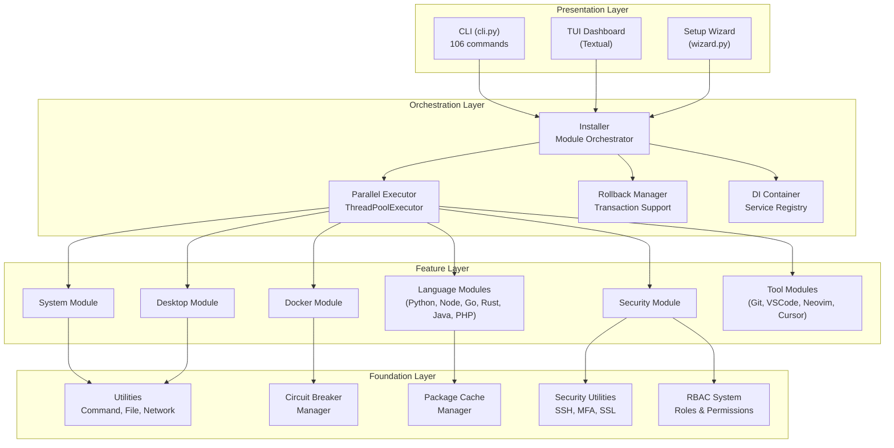
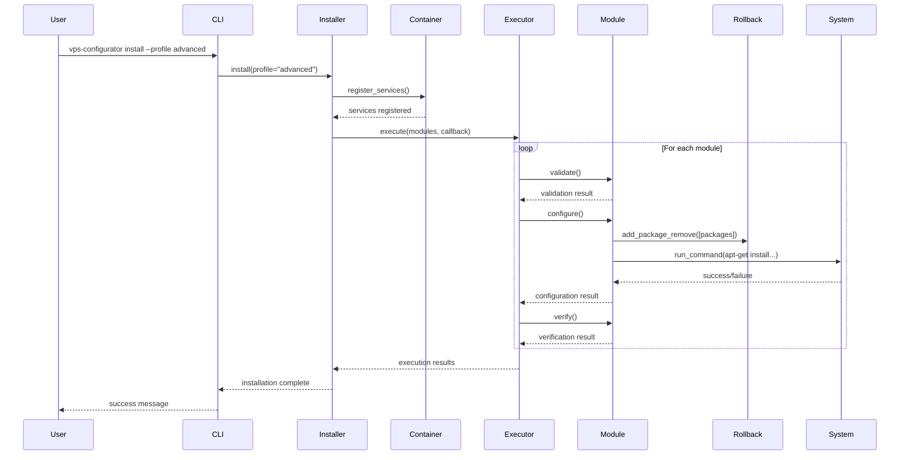
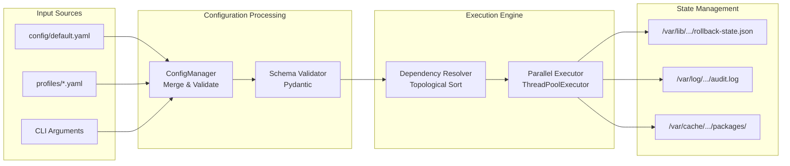
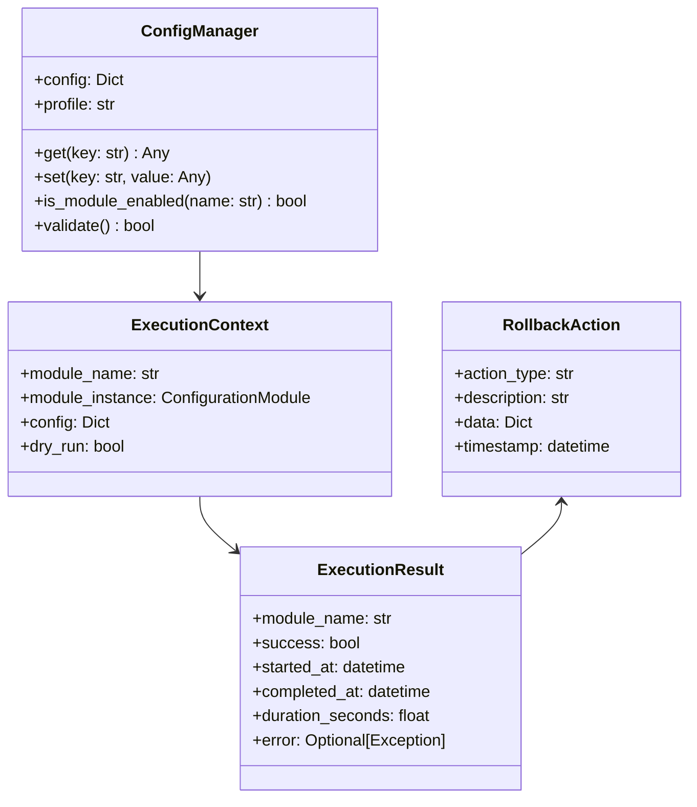

# Project Architecture Blueprint

**Debian VPS Configurator v2.0**

> Enterprise-Grade Automated VPS Configuration, Security Hardening, and User Management System

---

## Document Information

| Attribute                | Value                                     |
| ------------------------ | ----------------------------------------- |
| **Project**              | debian-vps-configurator                   |
| **Version**              | 2.0.0                                     |
| **Generated**            | 2026-01-17                                |
| **Primary Language**     | Python 3.12+                              |
| **Architecture Pattern** | Modular Plugin-Based Layered Architecture |

---

## Table of Contents

1. [Architectural Overview](#1-architectural-overview)
2. [Architecture Visualization](#2-architecture-visualization)
3. [Core Architectural Components](#3-core-architectural-components)
4. [Architectural Layers and Dependencies](#4-architectural-layers-and-dependencies)
5. [Data Architecture](#5-data-architecture)
6. [Cross-Cutting Concerns Implementation](#6-cross-cutting-concerns-implementation)
7. [Service Communication Patterns](#7-service-communication-patterns)
8. [Python-Specific Architectural Patterns](#8-python-specific-architectural-patterns)
9. [Implementation Patterns](#9-implementation-patterns)
10. [Testing Architecture](#10-testing-architecture)
11. [Deployment Architecture](#11-deployment-architecture)
12. [Extension and Evolution Patterns](#12-extension-and-evolution-patterns)
13. [Architectural Pattern Examples](#13-architectural-pattern-examples)
14. [Architectural Decision Records](#14-architectural-decision-records)
15. [Architecture Governance](#15-architecture-governance)
16. [Blueprint for New Development](#16-blueprint-for-new-development)

---

## 1. Architectural Overview

### 1.1 Overall Architectural Approach

The Debian VPS Configurator implements a **Modular Plugin-Based Layered Architecture** with four distinct layers. This architecture was chosen to:

- **Enable extensibility**: New features can be added as self-contained modules without modifying core infrastructure
- **Ensure testability**: Dependency injection and interface abstraction enable comprehensive testing
- **Support parallel execution**: Independent modules can execute concurrently for performance
- **Provide resilience**: Circuit breaker patterns and rollback capabilities ensure graceful degradation

### 1.2 Guiding Principles

| Principle                   | Implementation                                                               |
| --------------------------- | ---------------------------------------------------------------------------- |
| **Separation of Concerns**  | Each layer has distinct responsibilities with well-defined interfaces        |
| **Dependency Inversion**    | High-level modules depend on abstractions, not concrete implementations      |
| **Single Responsibility**   | Each module handles one specific configuration domain                        |
| **Fail-Safe Defaults**      | Security is enabled by default; dangerous operations require explicit opt-in |
| **Transactional Integrity** | All state-changing operations register rollback actions                      |
| **Thread Safety**           | Shared resources protected by locks; APT operations use global mutex         |

### 1.3 Architectural Boundaries

```
┌─────────────────────────────────────────────────────────────────┐
│                    EXTERNAL BOUNDARY                             │
│  (CLI Arguments, Config Files, System Commands, Network I/O)    │
└─────────────────────────────────────────────────────────────────┘
                                │
┌───────────────────────────────┼───────────────────────────────────┐
│                       APPLICATION CORE                            │
│  ┌─────────────────────────────────────────────────────────────┐ │
│  │ Presentation Layer (CLI, TUI, Wizard)                       │ │
│  └─────────────────────────────────────────────────────────────┘ │
│  ┌─────────────────────────────────────────────────────────────┐ │
│  │ Orchestration Layer (Installer, Executor, Rollback)         │ │
│  └─────────────────────────────────────────────────────────────┘ │
│  ┌─────────────────────────────────────────────────────────────┐ │
│  │ Feature Layer (24 Configuration Modules)                    │ │
│  └─────────────────────────────────────────────────────────────┘ │
│  ┌─────────────────────────────────────────────────────────────┐ │
│  │ Foundation Layer (Utils, Security, RBAC)                    │ │
│  └─────────────────────────────────────────────────────────────┘ │
└───────────────────────────────────────────────────────────────────┘
                                │
┌───────────────────────────────┼───────────────────────────────────┐
│                    INFRASTRUCTURE BOUNDARY                        │
│  (OS Services, Package Managers, File System, Network Services)  │
└───────────────────────────────────────────────────────────────────┘
```

---

## 2. Architecture Visualization

### 2.1 High-Level System Architecture



### 2.2 Component Interaction Diagram



### 2.3 Data Flow Diagram



---

## 3. Core Architectural Components

### 3.1 Presentation Layer

#### CLI Component (`configurator/cli.py`)

| Attribute        | Description                                                           |
| ---------------- | --------------------------------------------------------------------- |
| **Purpose**      | Primary user interface with 106 Click-based commands                  |
| **Size**         | ~3,618 lines                                                          |
| **Framework**    | Click 8.1+ with Rich integration                                      |
| **Key Commands** | `install`, `wizard`, `verify`, `rollback`, `security`, `user`, `team` |

**Internal Structure:**

- Command groups organized by domain (security, user, team, cache, etc.)
- Lazy loading of heavy dependencies for fast startup (<100ms)
- Rich console for formatted output
- Audit logging for security-sensitive operations

**Interaction Patterns:**

- Calls `Installer` for installation workflows
- Uses `Container` for dependency resolution
- Interfaces with `RBACManager` for permission checks

#### TUI Dashboard (`configurator/ui/`)

| Attribute     | Description                                        |
| ------------- | -------------------------------------------------- |
| **Purpose**   | Real-time monitoring interface during installation |
| **Framework** | Textual 0.40+                                      |
| **Features**  | Module status, resource monitoring, activity log   |

#### Setup Wizard (`configurator/wizard.py`)

| Attribute    | Description                                            |
| ------------ | ------------------------------------------------------ |
| **Purpose**  | Interactive guided setup for beginners                 |
| **Size**     | ~300 lines                                             |
| **Features** | Profile selection, component configuration, validation |

---

### 3.2 Orchestration Layer

#### Installer (`configurator/core/installer.py`)

| Attribute            | Description                                                    |
| -------------------- | -------------------------------------------------------------- |
| **Purpose**          | Central orchestrator for module execution                      |
| **Size**             | ~391 lines                                                     |
| **Responsibilities** | Service registration, module discovery, execution coordination |

**Key Methods:**

```python
class Installer:
    def __init__(self, config: ConfigManager, logger, reporter, container)
    def install(self, skip_validation, dry_run, parallel) -> bool
    def rollback(self) -> bool
    def verify(self) -> bool
```

**Design Patterns:**

- **Strategy Pattern**: Different execution strategies (parallel, sequential, hybrid)
- **Observer Pattern**: Callbacks for progress reporting
- **Factory Pattern**: Module instantiation through container

---

#### Container (`configurator/core/container.py`)

| Attribute   | Description                            |
| ----------- | -------------------------------------- |
| **Purpose** | Dependency Injection container         |
| **Size**    | ~154 lines                             |
| **Pattern** | Service Locator + Dependency Injection |

**Capabilities:**

- Singleton services (lazy instantiation, cached)
- Factory services (new instance each request)
- Mock injection for testing
- Circular dependency detection

```python
class Container:
    def singleton(self, name: str, factory: Callable) -> None
    def factory(self, name: str, factory: Callable) -> None
    def mock(self, name: str, instance: Any) -> None
    def get(self, name: str, **kwargs) -> Any
```

---

#### Parallel Executor (`configurator/core/execution/parallel.py`)

| Attribute          | Description                          |
| ------------------ | ------------------------------------ |
| **Purpose**        | Concurrent module execution          |
| **Size**           | ~172 lines                           |
| **Implementation** | ThreadPoolExecutor (NOT async/await) |

**Execution Flow:**

1. Submit all eligible modules to thread pool
2. Collect results as they complete
3. Report progress via callbacks
4. Handle failures gracefully

---

#### Rollback Manager (`configurator/core/rollback.py`)

| Attribute      | Description                                            |
| -------------- | ------------------------------------------------------ |
| **Purpose**    | Transaction-like rollback capabilities                 |
| **Size**       | ~259 lines                                             |
| **State File** | `/var/lib/debian-vps-configurator/rollback-state.json` |

**Rollback Action Types:**

- `command`: Shell command to undo changes
- `file_restore`: Restore file from backup
- `package_remove`: Remove installed packages
- `service_stop`: Stop and disable services

---

### 3.3 Feature Layer (Modules)

All modules inherit from `ConfigurationModule` abstract base class:

```python
class ConfigurationModule(ABC):
    name: str
    description: str
    priority: int  # Lower = earlier execution

    @abstractmethod
    def validate(self) -> bool

    @abstractmethod
    def configure(self) -> bool

    @abstractmethod
    def verify(self) -> bool

    def rollback(self) -> bool  # Default uses RollbackManager
```

#### Module Inventory

| Module      | File           | Priority | Dependencies     |
| ----------- | -------------- | -------- | ---------------- |
| `system`    | `system.py`    | 10       | -                |
| `security`  | `security.py`  | 20       | system           |
| `rbac`      | `rbac.py`      | 25       | security         |
| `desktop`   | `desktop.py`   | 30       | system, security |
| `git`       | `git.py`       | 40       | system           |
| `docker`    | `docker.py`    | 40       | system, security |
| `python`    | `python.py`    | 50       | system           |
| `nodejs`    | `nodejs.py`    | 50       | system           |
| `golang`    | `golang.py`    | 50       | system           |
| `rust`      | `rust.py`      | 50       | system           |
| `java`      | `java.py`      | 50       | system           |
| `php`       | `php.py`       | 50       | system           |
| `neovim`    | `neovim.py`    | 50       | system           |
| `databases` | `databases.py` | 50       | system           |
| `devops`    | `devops.py`    | 50       | system, python   |
| `vscode`    | `vscode.py`    | 60       | desktop          |
| `cursor`    | `cursor.py`    | 60       | desktop          |
| `wireguard` | `wireguard.py` | 30       | security         |
| `caddy`     | `caddy.py`     | 30       | security         |
| `netdata`   | `netdata.py`   | 90       | system           |

---

### 3.4 Foundation Layer

#### Utilities (`configurator/utils/`)

| Utility              | Purpose                                       |
| -------------------- | --------------------------------------------- |
| `command.py`         | Shell command execution with timeout, capture |
| `file.py`            | File operations, backup, restore              |
| `network.py`         | Network connectivity checks                   |
| `system.py`          | OS detection, resource checks                 |
| `retry.py`           | Exponential backoff retry decorator           |
| `circuit_breaker.py` | Circuit breaker pattern implementation        |
| `apt_cache.py`       | APT package cache management                  |
| `file_lock.py`       | Cross-process file locking                    |

#### Security Subsystem (`configurator/security/`)

| Component                  | Purpose                           | Size       |
| -------------------------- | --------------------------------- | ---------- |
| `cis_scanner.py`           | CIS benchmark compliance scanning | ~370 lines |
| `vulnerability_scanner.py` | CVE database scanning             | ~600 lines |
| `certificate_manager.py`   | SSL/TLS certificate management    | ~800 lines |
| `ssh_manager.py`           | SSH key management                | ~900 lines |
| `mfa_manager.py`           | TOTP/MFA implementation           | ~700 lines |
| `supply_chain.py`          | Checksum/signature verification   | ~850 lines |
| `input_validator.py`       | Input sanitization                | ~500 lines |

#### RBAC System (`configurator/rbac/`)

| Component         | Purpose                              |
| ----------------- | ------------------------------------ |
| `rbac_manager.py` | Role assignment, permission checking |
| `sudo_manager.py` | Sudo policy generation               |
| `roles.yaml`      | Role definitions                     |
| `permissions.py`  | Permission constants                 |

#### User Management (`configurator/users/`)

| Component              | Purpose                       |
| ---------------------- | ----------------------------- |
| `lifecycle_manager.py` | User provisioning/offboarding |
| `activity_monitor.py`  | Audit and anomaly detection   |
| `team_manager.py`      | Team/group management         |
| `temp_access.py`       | Time-limited access           |

---

## 4. Architectural Layers and Dependencies

### 4.1 Layer Structure

```
Layer 1: Presentation
    │
    ├── May import: Orchestration, Foundation
    ├── May NOT import: Feature (directly)
    │
Layer 2: Orchestration
    │
    ├── May import: Feature, Foundation
    ├── Provides: Module discovery, execution
    │
Layer 3: Feature
    │
    ├── May import: Foundation
    ├── May NOT import: Other modules (plugin isolation)
    │
Layer 4: Foundation
    │
    ├── May NOT import: Any higher layers
    └── Provides: Pure utilities, no business logic
```

### 4.2 Dependency Rules

> [!IMPORTANT]
> **Critical architectural constraint**: Modules in the Feature layer CANNOT import other modules. This ensures plugin isolation and prevents circular dependencies.

```python
# ✅ CORRECT: Module imports foundation utilities
from configurator.utils.command import run_command
from configurator.core.rollback import RollbackManager

# ❌ INCORRECT: Module imports another module
from configurator.modules.docker import DockerModule  # NEVER DO THIS
```

### 4.3 Dependency Injection Patterns

All components receive dependencies through constructor injection:

```python
class DockerModule(ConfigurationModule):
    def __init__(
        self,
        config: Dict[str, Any],
        logger: Optional[logging.Logger] = None,
        rollback_manager: Optional[RollbackManager] = None,
        dry_run_manager: Optional[DryRunManager] = None,
        circuit_breaker_manager: Optional[CircuitBreakerManager] = None,
        package_cache_manager: Optional[PackageCacheManager] = None,
    ):
        # Dependencies injected, not created internally
```

---

## 5. Data Architecture

### 5.1 Domain Model Structure



### 5.2 Data Access Patterns

| Pattern                | Usage                                            |
| ---------------------- | ------------------------------------------------ |
| **YAML Configuration** | `config/default.yaml`, `config/profiles/*.yaml`  |
| **JSON State Files**   | Rollback state, user registry, activity logs     |
| **SQLite Database**    | Activity monitoring (`/var/lib/.../activity.db`) |
| **File System**        | Package cache, backups, certificates             |

### 5.3 Configuration Schema

Configuration uses a nested dictionary structure with Pydantic validation:

```yaml
# Top-level sections
system: # Hostname, timezone, locale
security: # UFW, Fail2ban, SSH hardening
rbac: # Role-based access control
users: # User lifecycle, activity monitoring
desktop: # XRDP, XFCE, themes
languages: # Python, Node.js, Go, Rust, Java, PHP
tools: # Docker, Git, IDE editors
networking: # WireGuard, Caddy
monitoring: # Netdata
performance: # Parallel execution, circuit breaker
```

---

## 6. Cross-Cutting Concerns Implementation

### 6.1 Authentication & Authorization

**RBAC Implementation:**

```python
# Role definition (roles.yaml)
roles:
  admin:
    description: "Full system access"
    permissions: ["*"]
  developer:
    description: "Development environment access"
    permissions: ["docker:*", "git:*", "vscode:*"]
  viewer:
    description: "Read-only access"
    permissions: ["status:read", "logs:read"]
```

**Permission Checking:**

```python
class RBACManager:
    def has_permission(self, username: str, permission: str) -> bool
    def get_user_permissions(self, username: str) -> List[str]
    def check_sudo_access(self, username: str, command: str) -> bool
```

### 6.2 Error Handling & Resilience

**Custom Exception Hierarchy:**

```python
class ConfiguratorError(Exception):
    """Base exception with WHAT/WHY/HOW format"""
    def __init__(self, what: str, why: str, how: str, docs_link: str = None)

class PrerequisiteError(ConfiguratorError)  # System requirements not met
class ConfigurationError(ConfiguratorError)  # Invalid configuration
class ModuleExecutionError(ConfiguratorError)  # Module failed
class ValidationError(ConfiguratorError)  # Post-install verification failed
class RollbackError(ConfiguratorError)  # Rollback operation failed
class NetworkError(ConfiguratorError)  # Network-related failures
```

**Circuit Breaker Pattern:**

```python
class CircuitBreaker:
    """Prevents cascading failures"""

    States:
    - CLOSED: Normal operation, requests pass through
    - OPEN: Failures exceeded threshold, requests fail immediately
    - HALF_OPEN: Testing if service recovered

    Configuration:
    - failure_threshold: 3 (open after 3 failures)
    - timeout: 60s (retry after 60 seconds)
    - success_threshold: 1 (close after 1 success)
```

### 6.3 Logging & Monitoring

**Structured Logging:**

```python
# logging configuration
observability:
  logging:
    format: json  # Structured JSON logs
    level: INFO
    files:
      install: /var/log/vps-configurator/install.log
      error: /var/log/vps-configurator/error.log
      audit: /var/log/vps-configurator/audit.log
```

**Audit Events:**

```python
class AuditEventType(Enum):
    MODULE_STARTED = "module_started"
    MODULE_COMPLETED = "module_completed"
    MODULE_FAILED = "module_failed"
    SECURITY_CHANGE = "security_change"
    USER_CREATED = "user_created"
    PERMISSION_GRANTED = "permission_granted"
```

### 6.4 Validation

**Input Validation:**

```python
class InputValidator:
    """Validates and sanitizes user input"""

    def validate_username(self, username: str) -> bool
        # Pattern: ^[a-z][a-z0-9_-]{2,31}$

    def validate_path(self, path: str) -> bool
        # Whitelist-based path validation

    def sanitize_command(self, command: str) -> str
        # Remove dangerous shell metacharacters
```

### 6.5 Configuration Management

**Environment-Specific Configuration:**

```python
# Profile hierarchy (merged in order)
1. config/default.yaml          # All defaults
2. config/profiles/{profile}.yaml  # Profile overrides
3. CLI arguments                 # Runtime overrides

# Deep merge strategy
def _deep_merge(base: Dict, override: Dict) -> Dict:
    """Override values replace base values at leaf level"""
```

---

## 7. Service Communication Patterns

### 7.1 Service Boundaries

| Boundary          | Communication Method       |
| ----------------- | -------------------------- |
| CLI ↔ Core        | Direct function calls      |
| Core ↔ Modules    | Interface-based invocation |
| Modules ↔ System  | Shell command execution    |
| Modules ↔ Network | HTTP/HTTPS requests        |

### 7.2 Inter-Module Communication

Modules communicate indirectly through:

1. **Configuration**: Shared config dictionary
2. **State Files**: JSON state persistence
3. **Rollback Manager**: Coordinated rollback actions

> [!CAUTION]
> Direct module-to-module imports are prohibited. Use shared state or orchestration layer for coordination.

### 7.3 External Service Integration

```python
# Package repositories
def install_packages_resilient(packages: List[str]) -> bool:
    """
    Resilient package installation with:
    - Circuit breaker protection
    - Automatic retry with exponential backoff
    - Package cache for bandwidth savings
    """
```

---

## 8. Python-Specific Architectural Patterns

### 8.1 Module Organization

```
configurator/
├── __init__.py           # Package initialization
├── __main__.py          # Entry point: python -m configurator
├── __version__.py       # Version constant
├── cli.py               # Click command definitions
├── config.py            # ConfigManager class
├── exceptions.py        # Exception hierarchy
├── logger.py            # Logging configuration
│
├── core/                # Orchestration layer
│   ├── container.py     # DI container
│   ├── installer.py     # Main orchestrator
│   ├── rollback.py      # Rollback manager
│   ├── lazy_loader.py   # Lazy import utilities
│   └── execution/       # Execution strategies
│
├── modules/             # Feature modules (plugins)
│   ├── base.py          # Abstract base class
│   └── [24 modules]     # One per feature
│
├── security/            # Security subsystem
├── rbac/               # Access control
├── users/              # User management
└── utils/              # Foundation utilities
```

### 8.2 Lazy Loading System

```python
class LazyLoader:
    """
    Proxy object for deferred imports.
    Essential for <100ms CLI startup time.
    """

    def __init__(self, module_name: str, import_object: str = None):
        self._module_name = module_name
        self._import_object = import_object
        self._module = None  # Loaded on first access

    def __getattr__(self, name: str) -> Any:
        return getattr(self._load(), name)

    def __call__(self, *args, **kwargs) -> Any:
        return self._load()(*args, **kwargs)
```

**Usage in CLI:**

```python
# Heavy imports deferred until needed
RBACManager = LazyLoader("configurator.rbac.rbac_manager", "RBACManager")
UserLifecycleManager = LazyLoader("configurator.users.lifecycle_manager", "UserLifecycleManager")
```

### 8.3 Concurrency Model

> [!IMPORTANT]
> **This project uses ThreadPoolExecutor, NOT async/await.**
> This is a deliberate architectural decision for compatibility with blocking system calls.

```python
class ParallelExecutor:
    """Parallel execution using ThreadPoolExecutor"""

    def __init__(self, max_workers: int = 4):
        self.max_workers = max_workers

    def execute(self, contexts: List[ExecutionContext]) -> Dict[str, ExecutionResult]:
        with ThreadPoolExecutor(max_workers=self.max_workers) as executor:
            futures = {
                executor.submit(self._execute_module, ctx): ctx
                for ctx in contexts
            }
            for future in as_completed(futures):
                yield future.result()
```

### 8.4 Thread Safety

```python
class ConfigurationModule(ABC):
    """All APT operations protected by global lock"""

    _APT_LOCK = threading.Lock()  # Class-level lock

    def install_packages(self, packages: List[str]) -> bool:
        with self._APT_LOCK:  # Serialize APT operations
            return self._do_install(packages)
```

---

## 9. Implementation Patterns

### 9.1 Interface Design Patterns

**Abstract Base Class Pattern:**

```python
from abc import ABC, abstractmethod

class ConfigurationModule(ABC):
    """All modules must implement this interface"""

    name: str = "Base Module"
    description: str = "Base configuration module"
    priority: int = 100

    @abstractmethod
    def validate(self) -> bool: ...

    @abstractmethod
    def configure(self) -> bool: ...

    @abstractmethod
    def verify(self) -> bool: ...
```

### 9.2 Service Implementation Patterns

**Dependency Injection:**

```python
class Installer:
    def __init__(
        self,
        config: ConfigManager,
        logger: Optional[logging.Logger] = None,
        reporter: Optional[ReporterInterface] = None,
        container: Optional[Container] = None,
    ):
        self.config = config
        self.logger = logger or logging.getLogger(__name__)
        self.reporter = reporter or DEFAULT_REPORTER()
        self.container = container or Container()
```

### 9.3 Repository Implementation Patterns

**State Persistence:**

```python
class RollbackManager:
    """Persists rollback state for crash recovery"""

    state_file = Path("/var/lib/debian-vps-configurator/rollback-state.json")

    def _save_state(self) -> None:
        state = {
            "actions": [a.to_dict() for a in self.actions],
            "saved_at": datetime.now().isoformat(),
        }
        self.state_file.parent.mkdir(parents=True, exist_ok=True)
        with open(self.state_file, "w") as f:
            json.dump(state, f, indent=2)

    def load_state(self) -> bool:
        if self.state_file.exists():
            with open(self.state_file, "r") as f:
                state = json.load(f)
            self.actions = [RollbackAction.from_dict(a) for a in state["actions"]]
            return True
        return False
```

### 9.4 Domain Model Implementation

**Dataclass Pattern:**

```python
from dataclasses import dataclass, field
from datetime import datetime
from typing import Any, Dict, Optional

@dataclass
class RollbackAction:
    """Immutable value object for rollback actions"""
    action_type: str  # "command", "file_restore", "package_remove", "service_stop"
    description: str
    data: Dict[str, Any]
    timestamp: datetime = field(default_factory=datetime.now)

    def to_dict(self) -> Dict[str, Any]:
        return {
            "action_type": self.action_type,
            "description": self.description,
            "data": self.data,
            "timestamp": self.timestamp.isoformat(),
        }
```

---

## 10. Testing Architecture

### 10.1 Test Pyramid

```
                    ∧
                   /  \
                  / E2E \        (~10 tests)
                 /________\
                /          \
               / Integration \   (~50 tests)
              /______________\
             /                \
            /      Unit        \  (~350 tests)
           /____________________\
```

### 10.2 Test Directory Structure

```
tests/
├── conftest.py           # Shared fixtures
├── unit/                 # Fast, isolated tests
│   ├── test_config.py
│   ├── test_container.py
│   ├── test_rollback.py
│   └── [60+ test files]
├── integration/          # Component interaction tests
│   ├── test_installer.py
│   ├── test_parallel_execution.py
│   └── [25+ test files]
├── e2e/                  # End-to-end workflows
├── security/             # Security validation tests
├── performance/          # Performance benchmarks
└── validation/           # System validation (400+ checks)
```

### 10.3 Testing Patterns

**Fixture-Based Setup:**

```python
@pytest.fixture
def mock_config() -> Dict[str, Any]:
    """Create minimal test configuration"""
    return {
        "system": {"hostname": "test-workstation"},
        "security": {"enabled": True},
        "interactive": False,
    }

@pytest.fixture
def mock_run_command(monkeypatch):
    """Mock shell commands for isolated testing"""
    def mock_run(command, **kwargs):
        return CommandResult(command=command, return_code=0, stdout="", stderr="")
    monkeypatch.setattr("configurator.utils.command.run_command", mock_run)
    return mock_run
```

**Container Mocking:**

```python
def test_with_mock_dependencies():
    container = Container()
    container.mock("rollback_manager", MagicMock(spec=RollbackManager))
    container.mock("circuit_breaker", MagicMock(spec=CircuitBreakerManager))

    module = container.get("system_module")
    assert module.configure()
```

---

## 11. Deployment Architecture

### 11.1 Deployment Topology

```
┌─────────────────────────────────────────────────────────────┐
│                    Target VPS Server                         │
│                                                              │
│  ┌────────────────┐  ┌────────────────┐  ┌───────────────┐ │
│  │ Python 3.12+   │  │ vps-configurator│  │ Config Files  │ │
│  │ Virtual Env    │  │ (installed pkg) │  │ /etc/vps-*    │ │
│  └────────────────┘  └────────────────┘  └───────────────┘ │
│                                                              │
│  ┌─────────────────────────────────────────────────────────┐│
│  │                Installed Components                      ││
│  │  XRDP + XFCE │ Docker │ Python/Node │ Security Tools   ││
│  └─────────────────────────────────────────────────────────┘│
└─────────────────────────────────────────────────────────────┘
```

### 11.2 Installation Methods

| Method        | Command                               | Use Case        |
| ------------- | ------------------------------------- | --------------- |
| Quick Install | `./quick-install.sh`                  | Automated setup |
| Manual        | `pip install -e .`                    | Development     |
| PyPI          | `pip install debian-vps-configurator` | Production      |

### 11.3 State File Locations

| File           | Path                                                    | Purpose           |
| -------------- | ------------------------------------------------------- | ----------------- |
| Rollback State | `/var/lib/debian-vps-configurator/rollback-state.json`  | Crash recovery    |
| User Registry  | `/var/lib/debian-vps-configurator/users/registry.json`  | User tracking     |
| Activity DB    | `/var/lib/debian-vps-configurator/activity/activity.db` | Audit logs        |
| Package Cache  | `/var/cache/debian-vps-configurator/packages/`          | Bandwidth savings |
| Config         | `/etc/debian-vps-configurator/`                         | Runtime config    |

---

## 12. Extension and Evolution Patterns

### 12.1 Feature Addition Patterns

**Adding a New Module:**

1. **Create module file** in `configurator/modules/`:

```python
# configurator/modules/myfeature.py
from configurator.modules.base import ConfigurationModule

class MyFeatureModule(ConfigurationModule):
    name = "myfeature"
    description = "My new feature module"
    priority = 70

    def validate(self) -> bool:
        # Check prerequisites
        return True

    def configure(self) -> bool:
        # Install and configure
        self.install_packages(["mypackage"])
        return True

    def verify(self) -> bool:
        # Verify installation
        return self.command_exists("mycommand")
```

1. **Register in dependency graph** (`configurator/dependencies/registry.py`):

```python
ModuleDependencyInfo("myfeature", depends_on=["system"], priority=70)
```

1. **Add configuration section** to `config/default.yaml`:

```yaml
myfeature:
  enabled: false
  option1: value1
```

### 12.2 Modification Patterns

**Backward Compatibility:**

- Add optional parameters with defaults
- Deprecate with warnings before removal
- Use feature flags for gradual rollout

### 12.3 Integration Patterns

**External Service Integration:**

```python
class ExternalServiceAdapter:
    """Anti-corruption layer for external services"""

    def __init__(self, circuit_breaker: CircuitBreaker):
        self.circuit_breaker = circuit_breaker

    def call_external_api(self, endpoint: str) -> dict:
        return self.circuit_breaker.call(
            lambda: requests.get(endpoint).json()
        )
```

---

## 13. Architectural Pattern Examples

### 13.1 Layer Separation Example

```python
# Foundation Layer: Pure utility
# configurator/utils/command.py
def run_command(command: str, check: bool = True) -> CommandResult:
    """Execute shell command - no business logic"""
    result = subprocess.run(command, shell=True, capture_output=True)
    return CommandResult(...)

# Feature Layer: Uses foundation
# configurator/modules/docker.py
class DockerModule(ConfigurationModule):
    def configure(self) -> bool:
        # Uses utility, doesn't know about other modules
        self.run("apt-get install docker-ce",
                 rollback_command="apt-get remove docker-ce")
        return True

# Orchestration Layer: Coordinates modules
# configurator/core/installer.py
class Installer:
    def install(self) -> bool:
        # Coordinates module execution order
        for module in self._ordered_modules():
            module.configure()
```

### 13.2 Dependency Injection Example

```python
# Registration
container = Container()
container.singleton("config", lambda: ConfigManager())
container.singleton("logger", lambda: logging.getLogger("configurator"))
container.factory("docker_module", lambda c: DockerModule(
    config=c.get("config"),
    logger=c.get("logger"),
    rollback_manager=c.get("rollback_manager"),
))

# Resolution
docker = container.get("docker_module")
docker.configure()

# Testing with mocks
container.mock("logger", MagicMock())
container.mock("rollback_manager", MagicMock(spec=RollbackManager))
```

### 13.3 Circuit Breaker Example

```python
from configurator.utils.circuit_breaker import CircuitBreakerManager

class DockerModule(ConfigurationModule):
    def configure(self) -> bool:
        breaker = self.circuit_breaker_manager.get_breaker("docker-hub")

        try:
            # Protected external call
            result = breaker.call(
                lambda: self.run("docker pull nginx:latest")
            )
        except CircuitBreakerError as e:
            self.logger.warning(f"Docker Hub unavailable: {e}")
            # Graceful degradation: use cached image
            return self._use_cached_image("nginx")

        return True
```

---

## 14. Architectural Decision Records

### ADR-001: Modular Plugin Architecture

**Context**: Need extensibility for adding new configuration capabilities without modifying core infrastructure.

**Decision**: Implement plugin-based architecture where each feature is a self-contained module.

**Consequences**:

- ✅ Easy to add new features
- ✅ Modules can be developed/tested independently
- ❌ Slight overhead from abstraction layers

---

### ADR-002: ThreadPoolExecutor over async/await

**Context**: Python async/await could provide concurrent execution, but many operations are blocking system calls.

**Decision**: Use `ThreadPoolExecutor` for parallel execution.

**Consequences**:

- ✅ Compatible with blocking subprocess calls
- ✅ Simpler debugging and stack traces
- ❌ True parallelism limited by GIL (acceptable for I/O-bound work)

---

### ADR-003: Dependency Injection Container

**Context**: Need testability and decoupling of components.

**Decision**: Implement lightweight DI container with singleton/factory support.

**Consequences**:

- ✅ Full mockability in tests
- ✅ Lazy instantiation for performance
- ✅ Circular dependency detection
- ❌ Slightly more complex wiring code

---

### ADR-004: Circuit Breaker for External Services

**Context**: External services (package repos, Docker Hub) may be temporarily unavailable.

**Decision**: Implement circuit breaker pattern for all external calls.

**Consequences**:

- ✅ Prevents cascading failures
- ✅ Fast failure when service is known to be down
- ✅ Automatic recovery testing
- ❌ Additional complexity in error handling

---

### ADR-005: Transaction-like Rollback

**Context**: Failed installations should be reversible.

**Decision**: Implement rollback manager that tracks all state changes.

**Consequences**:

- ✅ Atomic installation attempts
- ✅ Safe experimentation
- ✅ Crash recovery via persisted state
- ❌ Every operation must register its rollback action

---

## 15. Architecture Governance

### 15.1 Architectural Compliance Checks

**Automated Checks:**

- Ruff linter with import order enforcement
- mypy type checking
- pytest with coverage requirements (85%+)

**Manual Review:**

- All PRs require architecture checklist
- Module additions require dependency graph update
- Security-sensitive changes require security review

### 15.2 Documentation Practices

| Document                | Purpose                | Update Frequency  |
| ----------------------- | ---------------------- | ----------------- |
| This Blueprint          | Architecture reference | Major changes     |
| README.md               | Quick start guide      | Each release      |
| copilot-instructions.md | AI code generation     | As needed         |
| Module docstrings       | API documentation      | With code changes |

---

## 16. Blueprint for New Development

### 16.1 Development Workflow

**For New Modules:**

1. **Design**: Document in implementation plan
2. **Create**: New file in `configurator/modules/`
3. **Register**: Add to dependency registry
4. **Configure**: Add config section to `default.yaml`
5. **Test**: Create unit tests in `tests/unit/`
6. **Integrate**: Create integration test
7. **Document**: Update README and config reference

### 16.2 Implementation Templates

**Module Template:**

```python
"""
MyFeature module for [description].
"""

import logging
from typing import Any, Dict, List, Optional

from configurator.modules.base import ConfigurationModule
from configurator.core.rollback import RollbackManager


class MyFeatureModule(ConfigurationModule):
    """Configure [feature description]."""

    name = "myfeature"
    description = "Install and configure [feature]"
    priority = 50  # Adjust based on dependencies

    def validate(self) -> bool:
        """Check prerequisites."""
        # Check OS, disk space, network, etc.
        return True

    def configure(self) -> bool:
        """Install and configure the feature."""
        packages = ["package1", "package2"]

        if not self.install_packages_resilient(packages):
            return False

        # Configure the feature
        self.run("systemctl enable myservice",
                 rollback_command="systemctl disable myservice")

        return True

    def verify(self) -> bool:
        """Verify installation succeeded."""
        if not self.is_service_active("myservice"):
            self.logger.warning("Service not running")
            return False
        return True
```

### 16.3 Common Pitfalls

> [!WARNING]
> **Architecture Violations to Avoid:**

1. **Importing other modules**: Never import `configurator.modules.x` from another module
2. **Bare except clauses**: Always catch specific exceptions
3. **Missing rollback registration**: All state changes need rollback actions
4. **APT without lock**: Always use `with self._APT_LOCK:`
5. **Async/await usage**: Use ThreadPoolExecutor instead

---

## Appendix: Technology Stack Summary

| Category          | Technology | Version |
| ----------------- | ---------- | ------- |
| **Language**      | Python     | 3.12+   |
| **CLI Framework** | Click      | ^8.1.0  |
| **TUI Framework** | Textual    | ^0.40.0 |
| **Config Format** | YAML       | -       |
| **Validation**    | Pydantic   | ^2.0.0  |
| **Testing**       | pytest     | ^7.4.0  |
| **Linting**       | Ruff       | ^0.1.0  |
| **Type Checking** | mypy       | ^1.5.0  |

---

_This document was generated on 2026-01-17 and should be updated when architectural changes are made._
